# IEEE TRANSACTIONS ON AUTOMATION SCIENCE AND ENGINEERING, VOL. 22, 2025

*本文档由自动化工具从PDF提取生成*

---

## 目录

1. [引言](#引言)
2. [Abstract—4D LiDAR semantic segmentation classifies the](#abstract-4d-lidar-semantic-segmentation-classifies-the)
3. [networks, which result in poor real-time performance. In this](#networks-which-result-in-poor-real-time-performance-in-this)
4. [Both results are combined in a motion-semantic fusion mod-](#both-results-are-combined-in-a-motion-semantic-fusion-mod)
5. [demonstrate that our method outperforms the state-of-the-art in](#demonstrate-that-our-method-outperforms-the-state-of-the-art-in)
6. [Through detailed runtime analysis, our method shows greater](#through-detailed-runtime-analysis-our-method-shows-greater)
7. [platform. The implementation of our method has been released at](#platform-the-implementation-of-our-method-has-been-released-at)
8. [predicted by our approach to reinforce tasks associated with](#predicted-by-our-approach-to-reinforce-tasks-associated-with)
9. [I. INTRODUCTION](#i-introduction)
10. [[1], [2]. As a result, LiDAR-based semantic perception has](#1-2-as-a-result-lidar-based-semantic-perception-has)
11. [our method achieves a more comprehensive understanding](#our-method-achieves-a-more-comprehensive-understanding)
12. [that our approach surpasses SOTA in both 4D semantic seg-](#that-our-approach-surpasses-sota-in-both-4d-semantic-seg)
13. [method shows greater efficiency, enabling real-time operation.](#method-shows-greater-efficiency-enabling-real-time-operation)
14. [Segmentation (MOS). The results are then combined](#segmentation-mos-the-results-are-then-combined)
15. [automated method to generate instance bounding box](#automated-method-to-generate-instance-bounding-box)
16. [• a fully 4D semantic segmentation method that predicts](#a-fully-4d-semantic-segmentation-method-that-predicts)
17. [enabling this method to operate in real-time.](#enabling-this-method-to-operate-in-real-time)
18. [demonstrating this method’s superior performance and](#demonstrating-this-method-s-superior-performance-and)
19. [II. RELATED WORK](#ii-related-work)
20. [The projection-based method typically converts sequential](#the-projection-based-method-typically-converts-sequential)
21. [a distribution-based data augmentation method to improve the](#a-distribution-based-data-augmentation-method-to-improve-the)
22. [embedded platform. However, this method can only perform](#embedded-platform-however-this-method-can-only-perform)
23. [method based on [26], which learns spatio-temporal occupancy](#method-based-on-26-which-learns-spatio-temporal-occupancy)
24. [method](#method)
25. [based on this approach for dataset annotation.](#based-on-this-approach-for-dataset-annotation)
26. [our method streamlines the process by directly incorporating](#our-method-streamlines-the-process-by-directly-incorporating)
27. [and fusing them for 4D semantic segmentation, our method](#and-fusing-them-for-4d-semantic-segmentation-our-method)
28. [The framework of our proposed method is depicted in](#the-framework-of-our-proposed-method-is-depicted-in)
29. [try approach [4], [7]. We use the poses estimated by](#try-approach-4-7-we-use-the-poses-estimated-by)
30. [in Fig. 4. Our approach can obtain initial motion cues for](#in-fig-4-our-approach-can-obtain-initial-motion-cues-for)
31. [a method to automatically generate instance bounding boxes](#a-method-to-automatically-generate-instance-bounding-boxes)
32. [it by L-Shape method [40]. Finally, we utilize CenterHead](#it-by-l-shape-method-40-finally-we-utilize-centerhead)
33. [approaches often result in suboptimal network performance in](#approaches-often-result-in-suboptimal-network-performance-in)
34. [separately. By explicitly supervising MOS, our method can](#separately-by-explicitly-supervising-mos-our-method-can)
35. [labels, a straightforward approach to achieve 4D semantic](#labels-a-straightforward-approach-to-achieve-4d-semantic)
36. [results. We hence propose a motion-semantic fusion module](#results-we-hence-propose-a-motion-semantic-fusion-module)
37. [This bottom-up aims to refine the results of the follow-](#this-bottom-up-aims-to-refine-the-results-of-the-follow)
38. [In this section, we conduct a series of experiments on](#in-this-section-we-conduct-a-series-of-experiments-on)
39. [mance with SOTA. Subsequently, we integrate the method into](#mance-with-sota-subsequently-we-integrate-the-method-into)
40. [utility. Besides, we perform ablation experiments to evaluate](#utility-besides-we-perform-ablation-experiments-to-evaluate)
41. [IV-E). These experimental results will substantiate our claims](#iv-e-these-experimental-results-will-substantiate-our-claims)
42. [“MOV.” DENOTES MOVING. THE BEST RESULTS ARE IN BOLD](#mov-denotes-moving-the-best-results-are-in-bold)
43. [of our approach on the SemanticKITTI multi-scan semantic](#of-our-approach-on-the-semantickitti-multi-scan-semantic)
44. [the results with LiDAR-only SOTA baselines, including (a)](#the-results-with-lidar-only-sota-baselines-including-a)
45. [approach achieves a mIoU of 60.9% on the SemanticKITTI](#approach-achieves-a-miou-of-60-9-on-the-semantickitti)
46. [approach capable of real-time operation on the SemanticKITTI](#approach-capable-of-real-time-operation-on-the-semantickitti)
47. [Fig. 7. The qualitative results comparison between our approach and MarS3D on the nuScenes dataset.](#fig-7-the-qualitative-results-comparison-between-our-approach-and-mars3d-on-the-nuscenes-dataset)
48. [Additionally, we further evaluate our approach on the](#additionally-we-further-evaluate-our-approach-on-the)
49. [As shown in Tab. II, our method consistently delivers the](#as-shown-in-tab-ii-our-method-consistently-delivers-the)
50. [approach’s superior ability for moving object recognition.](#approach-s-superior-ability-for-moving-object-recognition)
51. [presented in the Sec. IV-B. Additionally, our method exhibits](#presented-in-the-sec-iv-b-additionally-our-method-exhibits)
52. [trasting with Mars3D’s incomplete segmentation results. This](#trasting-with-mars3d-s-incomplete-segmentation-results-this)
53. [We evaluate the result on the SemanticKITTI-MOS bench-](#we-evaluate-the-result-on-the-semantickitti-mos-bench)
54. [method achieves the best results on both the SemanticKITTI](#method-achieves-the-best-results-on-both-the-semantickitti)
55. [Our self-developed tracked mobile platform for experiments. For](#our-self-developed-tracked-mobile-platform-for-experiments-for)
56. [method significantly outperforms other 4D semantic segmen-](#method-significantly-outperforms-other-4d-semantic-segmen)
57. [Our method achieves real-time operation at 15.7Hz rate](#our-method-achieves-real-time-operation-at-15-7hz-rate)
58. [qualitatively compare the semantic segmentation results with](#qualitatively-compare-the-semantic-segmentation-results-with)
59. [SegNet4D gets the best segmentation results, demonstrating its](#segnet4d-gets-the-best-segmentation-results-demonstrating-its)
60. [The qualitative comparison on our campus scene. Our approach](#the-qualitative-comparison-on-our-campus-scene-our-approach)
61. [From the results shown in Tab. IV, our method still possesses](#from-the-results-shown-in-tab-iv-our-method-still-possesses)
62. [The above-mentioned experimental results show that Seg-](#the-above-mentioned-experimental-results-show-that-seg)
63. [In this section, we conduct a series of ablation experiments](#in-this-section-we-conduct-a-series-of-ablation-experiments)
64. [tiveness. The results are shown in Tab. V, Here, “Instance”](#tiveness-the-results-are-shown-in-tab-v-here-instance)
65. [and finally merging their results to achieve multi-scan semantic](#and-finally-merging-their-results-to-achieve-multi-scan-semantic)
66. [instance-aware segmentation capabilities, and the results sub-](#instance-aware-segmentation-capabilities-and-the-results-sub)
67. [to the results obtained by manually integrating outputs from](#to-the-results-obtained-by-manually-integrating-outputs-from)
68. [thereby supporting our first claims. The results of [C] and](#thereby-supporting-our-first-claims-the-results-of-c-and)
69. [We can see that the MSFM’s segmentation result always](#we-can-see-that-the-msfm-s-segmentation-result-always)
70. [As shown in Tab. VI, our method achieves the fastest runtime](#as-shown-in-tab-vi-our-method-achieves-the-fastest-runtime)
71. [V. CONCLUSION AND FUTURE WORK](#v-conclusion-and-future-work)
72. [method to predict both point-wise moving labels and semantic](#method-to-predict-both-point-wise-moving-labels-and-semantic)
73. [projection-based approach to quickly obtain motion features,](#projection-based-approach-to-quickly-obtain-motion-features)
74. [guided 4D semantic segmentation. Extensive experiments on](#guided-4d-semantic-segmentation-extensive-experiments-on)
75. [demonstrate the superiority of our method. The detailed run-](#demonstrate-the-superiority-of-our-method-the-detailed-run)
76. [REFERENCES](#references)
77. [[16] P. Schutt, R. A. Rosu, and S. Behnke, “Abstract flow for temporal](#16-p-schutt-r-a-rosu-and-s-behnke-abstract-flow-for-temporal)
78. [A learning-based approach exploiting sequential data,” IEEE Robot.](#a-learning-based-approach-exploiting-sequential-data-ieee-robot)
79. [[48] D. Kingma and J. Ba, “Adam: A method for stochastic optimization,”](#48-d-kingma-and-j-ba-adam-a-method-for-stochastic-optimization)

---

## 引言

*页码范围: 第 1 页开始*

IEEE TRANSACTIONS ON AUTOMATION SCIENCE AND ENGINEERING, VOL. 22, 2025
15339
SegNet4D: Efficient Instance-Aware 4D Semantic
Segmentation for LiDAR Point Cloud
Neng Wang , Ruibin Guo , Chenghao Shi , Ziyue Wang, Hui Zhang, Huimin Lu , Member, IEEE,
Zhiqiang Zheng, and Xieyuanli Chen , Member, IEEE

### 解析说明

[待解析：在此处填写对本节的中文解析]

---

## Abstract—4D LiDAR semantic segmentation classifies the

*页码范围: 第 1 页开始*

semantic category of each LiDAR point and detects whether
it is dynamic, a critical ability for tasks like obstacle avoid-
ance and autonomous navigation. Existing approaches often
rely on computationally heavy 4D convolutions or recursive

### 解析说明

[待解析：在此处填写对本节的中文解析]

---

## networks, which result in poor real-time performance. In this

*页码范围: 第 1 页开始*

paper, we introduce SegNet4D, a novel real-time 4D seman-
tic segmentation network, offering both efficiency and strong
semantic understanding. SegNet4D addresses 4D segmentation
as two tasks: single-scan semantic segmentation and moving
object segmentation, each tackled by a separate network head.

### 解析说明

[待解析：在此处填写对本节的中文解析]

---

## Both results are combined in a motion-semantic fusion mod-

*页码范围: 第 1 页开始*

ule to achieve comprehensive 4D segmentation. Additionally,
instance information is extracted from the current scan and
exploited for instance-wise segmentation consistency. Extensive

### 解析说明

[待解析：在此处填写对本节的中文解析]

---

## demonstrate that our method outperforms the state-of-the-art in

*页码范围: 第 1 页开始*

both 4D semantic segmentation and moving object segmentation.

### 解析说明

[待解析：在此处填写对本节的中文解析]

---

## Through detailed runtime analysis, our method shows greater

*页码范围: 第 1 页开始*

efficiency, enabling real-time operation. Besides, its effectiveness
and efficiency have also been validated on a real-world robotic

### 解析说明

[待解析：在此处填写对本节的中文解析]

---

## platform. The implementation of our method has been released at

*页码范围: 第 1 页开始*

https://github.com/nubot-nudt/SegNet4D
Note to Practitioners—This paper focuses on enhancing the
efficiency of 4D semantic segmentation for applications in
autonomous driving or navigation. Existing LiDAR-based 4D
semantic segmentation methods fall short of real-time process-
ing capabilities, thereby severely limiting their practicality for
autonomous vehicles and robotic systems. To tackle these issues,
we design a high-efficiency 4D semantic segmentation network
that not only performs real-time operations on real-world robotic
systems but also delivers superior performance, validating its
practical utility. Future work can further leverage the instance
information we introduced to improve the network’s functionality
by achieving panoptic segmentation or 4D panoptic segmentation.
Furthermore, some studies may use the 4D semantic labels

### 解析说明

[待解析：在此处填写对本节的中文解析]

---

## predicted by our approach to reinforce tasks associated with

*页码范围: 第 1 页开始*

robotic autonomy.
Received 24 December 2024; revised 1 April 2025; accepted 2 May 2025.
Date of publication 9 May 2025; date of current version 23 May 2025.
This article was recommended for publication by Associate Editor Y. Sun
and Editor J. Yi upon evaluation of the reviewers’ comments. This work
was supported in part by the National Science Foundation of China under
Grant 62403478, Grant U22A2059, and Grant 62203460; in part by the
Young Elite Scientists Sponsorship Program by China Association for Science
and Technology (CAST) under Grant 2023QNRC001; and in part by the
Major Project of Natural Science Foundation of Hunan Province under Grant
2021JC0004. (Corresponding author: Xieyuanli Chen.)
The authors are with the College of Intelligence Science and Technology
and the National Key Laboratory of Equipment State Sensing and Smart
Support, National University of Defense Technology, Changsha 410073, China
(e-mail: xieyuanli.chen@nudt.edu.cn).
Digital Object Identifier 10.1109/TASE.2025.3568001
Index Terms—4D semantic segmentation, deep learning, mov-
ing object segmentation, LiDAR point cloud.

### 解析说明

[待解析：在此处填写对本节的中文解析]

---

## I. INTRODUCTION

*页码范围: 第 1 页开始*

L
IGHT Detection and Ranging (LiDAR) sensors, have
become important for autonomous vehicles and robots
to achieve autonomy due to their resilience to illumination
changes, wide field of views, and accurate range measurements

### 解析说明

[待解析：在此处填写对本节的中文解析]

---

## [1], [2]. As a result, LiDAR-based semantic perception has

*页码范围: 第 1 页开始*

garnered extensive research interest in recent years. Semantic
segmentation using 3D LiDAR data aims to assign a specific
semantic class label to each point in the acquired point
clouds, serving as a fundamental task in 3D perception and
scene understanding. This technology significantly enhances
key autonomous functions such as navigation [3], point cloud
registration [4], [5], and and simultaneous localization and
mapping (SLAM) [6], [7].
In practical applications, however, single-scan 3D LiDAR
semantic segmentation methods [1], [8], [9], [10] face inherent
limitations due to their inability to capture motion dynamics,
a crucial factor for effective obstacle avoidance and local
path planning in autonomous systems. To address this, 4D
semantic understanding is necessary. As shown in Fig. 1, it
categorizes each LiDAR point while identifying its dynamic
attributes [11], [12], [13]. This task typically relies on sequen-
tial LiDAR scans to capture motion information. In this regard,
some methods directly stack historical LiDAR scans into
a single point cloud and feed it into a single-scan-based
semantic network for achieving 4D segmentation [1], [9],
[14], which leads to suboptimal performance due to the lack
of motion information association. Other approaches use 4D
convolutional neural networks [15] or recursive networks [12],
[16] to extract motion features from input sequential LiDAR
scans. However, these approaches impose heavy computational
burdens and make real-time operations challenging. Moreover,
existing methods commonly treat 4D semantic segmentation
in an end-to-end fashion, directly predicting semantic labels
for all categories, including those moving and static classes.
This may lead to limited performance in recognizing dynamic
objects because moving points are often fewer than static
background points in most datasets.
To address these challenges, building upon our previous
work InsMOS [17], we propose an extended framework
for 4D semantic segmentation. Our key idea is to tackle
4D semantic segmentation by dividing it into two subtasks:
single-scan semantic segmentation (SSS) and moving object
1558-3783 © 2025 IEEE. All rights reserved, including rights for text and data mining, and training of artificial intelligence and
similar technologies. Personal use is permitted, but republication/redistribution requires IEEE permission.
See https://www.ieee.org/publications/rights/index.html for more information.
Authorized licensed use limited to: Hebei University of Technology. Downloaded on December 17,2025 at 07:34:24 UTC from IEEE Xplore.  Restrictions apply. 
15340
IEEE TRANSACTIONS ON AUTOMATION SCIENCE AND ENGINEERING, VOL. 22, 2025
Fig. 1.
Our SegNet4D performs real-time, online prediction of semantic
categories while simultaneously identifying the motion state of each point.
This capability greatly aids in downstream tasks including obstacle avoidance,
path planning, and navigation, thereby enhancing the autonomous capabilities
of robots.
segmentation (MOS). We argue that semantic classes and
motion characteristics represent distinct aspects of objects.
By addressing them separately and then fusing their outputs,

### 解析说明

[待解析：在此处填写对本节的中文解析]

---

## our method achieves a more comprehensive understanding

*页码范围: 第 2 页开始*

and superior performance compared to end-to-end approaches.
To enhance efficiency, our framework converts the sequential
LiDAR scans into Bird’s Eye View (BEV) images and extracts
motion features by calculating BEV residuals, significantly
reducing computational cost compared to existing fashion
using 4D convolutions or recursive networks. Furthermore, we
find instance information [17], [18] is crucial for the LiDAR
segmentation tasks to prevent over-segmentation. However,
existing methods struggle to integrate this information effec-
tively. To address this, we incorporate instance consistency
from the current scan into the prediction pipeline at both
feature and point levels, enabling instance-aware segmenta-
tion. Finally, we design a novel module to fuse point-wise
semantic predictions and motion states to achieve accurate
4D semantic segmentation online. We extensively evaluate
SegNet4D on mainstream datasets, comparing its performance

### 图片 (第 2 页)

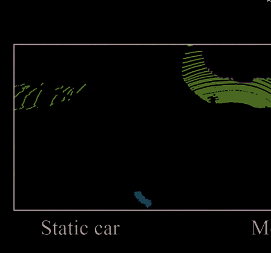

*图片来源: PDF 第 2 页, 文件名: page_02_img_1.png*

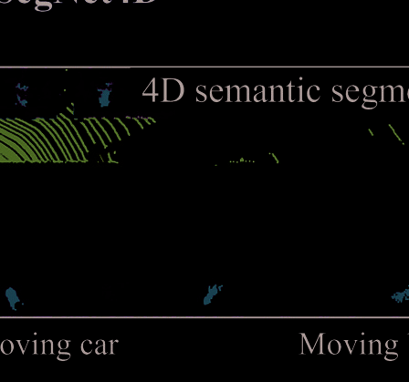

*图片来源: PDF 第 2 页, 文件名: page_02_img_2.png*

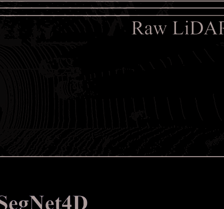

*图片来源: PDF 第 2 页, 文件名: page_02_img_3.png*

*图片来源: PDF 第 2 页, 文件名: page_02_img_4.png*

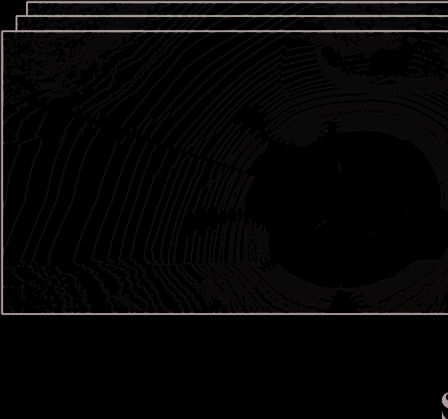

*图片来源: PDF 第 2 页, 文件名: page_02_img_5.png*

### 解析说明

[待解析：在此处填写对本节的中文解析]

---

## that our approach surpasses SOTA in both 4D semantic seg-

*页码范围: 第 2 页开始*

mentation and MOS. Through detailed runtime analysis, our

### 图片 (第 2 页)

*图片来源: PDF 第 2 页, 文件名: page_02_img_1.png*

*图片来源: PDF 第 2 页, 文件名: page_02_img_2.png*

*图片来源: PDF 第 2 页, 文件名: page_02_img_3.png*

*图片来源: PDF 第 2 页, 文件名: page_02_img_4.png*

*图片来源: PDF 第 2 页, 文件名: page_02_img_5.png*

### 解析说明

[待解析：在此处填写对本节的中文解析]

---

## method shows greater efficiency, enabling real-time operation.

*页码范围: 第 2 页开始*

Additionally, we validate its practical utility on a real robotic
platform, demonstrating both its effectiveness and efficiency
for autonomous applications.
In summary, the contributions of this work are threefold:
• We propose a novel 4D semantic segmentation framework
that decomposes the task into two subtasks: Single-
Scan Semantic Segmentation (SSS) and Moving Object

### 图片 (第 2 页)

*图片来源: PDF 第 2 页, 文件名: page_02_img_1.png*

*图片来源: PDF 第 2 页, 文件名: page_02_img_2.png*

*图片来源: PDF 第 2 页, 文件名: page_02_img_3.png*

*图片来源: PDF 第 2 页, 文件名: page_02_img_4.png*

*图片来源: PDF 第 2 页, 文件名: page_02_img_5.png*

### 解析说明

[待解析：在此处填写对本节的中文解析]

---

## Segmentation (MOS). The results are then combined

*页码范围: 第 2 页开始*

using a motion-semantic fusion module, achieving SOTA
performance in both 4D semantic segmentation and MOS.
• We propose a novel instance-aware backbone that lever-
ages instance information at both the feature and point
levels, enhancing performance in both MOS and seman-
tic segmentation tasks. Additionally, we introduce an

### 图片 (第 2 页)

*图片来源: PDF 第 2 页, 文件名: page_02_img_1.png*

*图片来源: PDF 第 2 页, 文件名: page_02_img_2.png*

*图片来源: PDF 第 2 页, 文件名: page_02_img_3.png*

*图片来源: PDF 第 2 页, 文件名: page_02_img_4.png*

*图片来源: PDF 第 2 页, 文件名: page_02_img_5.png*

### 解析说明

[待解析：在此处填写对本节的中文解析]

---

## automated method to generate instance bounding box

*页码范围: 第 2 页开始*

labels directly from semantic annotations, eliminating the
need for additional manual labeling.
• We propose an efficient 4D semantic segmentation net-
work that is significantly faster than existing methods
and supports real-time operation. Furthermore, we suc-
cessfully integrate the network into a real platform,
demonstrating its practical utility for autonomous appli-
cations.
This article is an extension of our previous conference paper,
i.e., InsMOS [17], which proposed to add instance information
for MOS. Compared to [17], this article extends it in four
critical aspects:

### 图片 (第 2 页)

*图片来源: PDF 第 2 页, 文件名: page_02_img_1.png*

*图片来源: PDF 第 2 页, 文件名: page_02_img_2.png*

*图片来源: PDF 第 2 页, 文件名: page_02_img_3.png*

*图片来源: PDF 第 2 页, 文件名: page_02_img_4.png*

*图片来源: PDF 第 2 页, 文件名: page_02_img_5.png*

### 解析说明

[待解析：在此处填写对本节的中文解析]

---

## • a fully 4D semantic segmentation method that predicts

*页码范围: 第 2 页开始*

both the motion states and semantic categories.
• a novel module for integrating point-wise motion states
and semantic category predictions.
• a more efficient mechanism for encoding motion features,

### 图片 (第 2 页)

*图片来源: PDF 第 2 页, 文件名: page_02_img_1.png*

*图片来源: PDF 第 2 页, 文件名: page_02_img_2.png*

*图片来源: PDF 第 2 页, 文件名: page_02_img_3.png*

*图片来源: PDF 第 2 页, 文件名: page_02_img_4.png*

*图片来源: PDF 第 2 页, 文件名: page_02_img_5.png*

### 解析说明

[待解析：在此处填写对本节的中文解析]

---

## enabling this method to operate in real-time.

*页码范围: 第 2 页开始*

• a more extensive experimental evaluation on multiple
datasets and a real-world unmanned ground platform,

### 图片 (第 2 页)

*图片来源: PDF 第 2 页, 文件名: page_02_img_1.png*

*图片来源: PDF 第 2 页, 文件名: page_02_img_2.png*

*图片来源: PDF 第 2 页, 文件名: page_02_img_3.png*

*图片来源: PDF 第 2 页, 文件名: page_02_img_4.png*

*图片来源: PDF 第 2 页, 文件名: page_02_img_5.png*

### 解析说明

[待解析：在此处填写对本节的中文解析]

---

## demonstrating this method’s superior performance and

*页码范围: 第 2 页开始*

practical utility.

### 图片 (第 2 页)

*图片来源: PDF 第 2 页, 文件名: page_02_img_1.png*

*图片来源: PDF 第 2 页, 文件名: page_02_img_2.png*

*图片来源: PDF 第 2 页, 文件名: page_02_img_3.png*

*图片来源: PDF 第 2 页, 文件名: page_02_img_4.png*

*图片来源: PDF 第 2 页, 文件名: page_02_img_5.png*

### 解析说明

[待解析：在此处填写对本节的中文解析]

---

## II. RELATED WORK

*页码范围: 第 2 页开始*

A. Moving Object Segmentation
MOS refers to accurately identifying dynamic regions
or objects from input data. The task has attracted exten-
sive research in the field of computer vision [19], [20]. In
recent years, some research has also been paid attention
to LiDAR-based MOS. We categorize these methods into
projection-based and non-projection-based.

### 图片 (第 2 页)

*图片来源: PDF 第 2 页, 文件名: page_02_img_1.png*

*图片来源: PDF 第 2 页, 文件名: page_02_img_2.png*

*图片来源: PDF 第 2 页, 文件名: page_02_img_3.png*

*图片来源: PDF 第 2 页, 文件名: page_02_img_4.png*

*图片来源: PDF 第 2 页, 文件名: page_02_img_5.png*

### 解析说明

[待解析：在此处填写对本节的中文解析]

---

## The projection-based method typically converts sequential

*页码范围: 第 2 页开始*

point clouds into image representations, such as range images
[2], [21], [22], [23] or BEV images [24], [25], and then
compute the residuals of sequential images to extract motion
information in the scene. Chen et al. [21] first released the
MOS datasets and benchmark based on the SemanticKITTI
dataset [14], and proposed a deep neural network to learn
motion cues from sequential residual range images for online
MOS. To extract motion features more comprehensively,
Sun et al. [22] proposed a dual-branch network architecture
that separately encodes the appearance features and temporal
motion features, and then fuses them with a multi-scale
motion-guided attention module. Subsequently, Cheng et al.
[23] utilized a similar dual-branch architecture and proposed

### 图片 (第 2 页)

*图片来源: PDF 第 2 页, 文件名: page_02_img_1.png*

*图片来源: PDF 第 2 页, 文件名: page_02_img_2.png*

*图片来源: PDF 第 2 页, 文件名: page_02_img_3.png*

*图片来源: PDF 第 2 页, 文件名: page_02_img_4.png*

*图片来源: PDF 第 2 页, 文件名: page_02_img_5.png*

### 解析说明

[待解析：在此处填写对本节的中文解析]

---

## a distribution-based data augmentation method to improve the

*页码范围: 第 2 页开始*

network robustness. Kim et al. [2] also designed a similar
multi-branch network to improve MOS accuracy, where one
branch performs semantic segmentation to obtain movable
objects, and another branch network extracts motion fea-
tures. Finally, a fusion branch network is utilized to merge
these features to achieve better MOS. Unlike range images,
BEV images offer a top-down perspective, allowing a more
intuitive observation of object movement. Based on this,
Authorized licensed use limited to: Hebei University of Technology. Downloaded on December 17,2025 at 07:34:24 UTC from IEEE Xplore.  Restrictions apply. 
WANG et al.: SegNet4D: EFFICIENT INSTANCE-AWARE 4D SEMANTIC SEGMENTATION
15341
Mohapatra et al. [24] designed a lightweight network archi-
tecture for extracting motion information from BEV residual
images and successfully achieved real-time operation in an

### 图片 (第 2 页)

*图片来源: PDF 第 2 页, 文件名: page_02_img_1.png*

*图片来源: PDF 第 2 页, 文件名: page_02_img_2.png*

*图片来源: PDF 第 2 页, 文件名: page_02_img_3.png*

*图片来源: PDF 第 2 页, 文件名: page_02_img_4.png*

*图片来源: PDF 第 2 页, 文件名: page_02_img_5.png*

### 解析说明

[待解析：在此处填写对本节的中文解析]

---

## embedded platform. However, this method can only perform

*页码范围: 第 3 页开始*

pixel-wise segmentation in the BEV space and has relatively
low accuracy. Recently, Zhou et al. [25] projected 3D point
clouds into the polar coordinate BEV space and designed a
dual-branch network structure similar to [22] to enhance the
MOS performance.
Different from the projection-based methods, the non-
projection methods directly extract motion information from
sequential 3D point clouds. Mersch et al. [26] utilized the
Minkowski engine [15] to construct a sparse 4D convolutional
network. This network is designed to extract spatio-temporal
features from the input 4D point clouds and predict point-wise
moving labels. They also proposed a receding horizon strategy
that integrates multiple observations to refine the network’s
predictions. Kreutz et al. [27] proposed an unsupervised MOS

### 图片 (第 3 页)

*图片来源: PDF 第 3 页, 文件名: page_03_img_1.png*

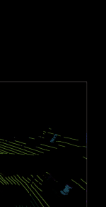

*图片来源: PDF 第 3 页, 文件名: page_03_img_2.png*

*图片来源: PDF 第 3 页, 文件名: page_03_img_3.png*

*图片来源: PDF 第 3 页, 文件名: page_03_img_4.png*

*图片来源: PDF 第 3 页, 文件名: page_03_img_5.png*

*图片来源: PDF 第 3 页, 文件名: page_03_img_6.png*

*图片来源: PDF 第 3 页, 文件名: page_03_img_7.png*

*图片来源: PDF 第 3 页, 文件名: page_03_img_8.png*

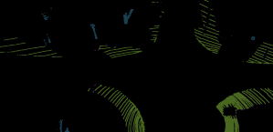

*图片来源: PDF 第 3 页, 文件名: page_03_img_9.png*

*图片来源: PDF 第 3 页, 文件名: page_03_img_10.png*

*图片来源: PDF 第 3 页, 文件名: page_03_img_11.png*

*图片来源: PDF 第 3 页, 文件名: page_03_img_12.png*

*图片来源: PDF 第 3 页, 文件名: page_03_img_13.png*

*图片来源: PDF 第 3 页, 文件名: page_03_img_14.png*

*图片来源: PDF 第 3 页, 文件名: page_03_img_15.png*

*图片来源: PDF 第 3 页, 文件名: page_03_img_16.png*

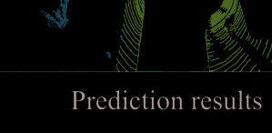

*图片来源: PDF 第 3 页, 文件名: page_03_img_17.png*

*图片来源: PDF 第 3 页, 文件名: page_03_img_18.png*

*图片来源: PDF 第 3 页, 文件名: page_03_img_19.png*

*图片来源: PDF 第 3 页, 文件名: page_03_img_20.png*

*图片来源: PDF 第 3 页, 文件名: page_03_img_21.png*

*图片来源: PDF 第 3 页, 文件名: page_03_img_22.png*

*图片来源: PDF 第 3 页, 文件名: page_03_img_23.png*

*图片来源: PDF 第 3 页, 文件名: page_03_img_24.png*

*图片来源: PDF 第 3 页, 文件名: page_03_img_25.png*

### 解析说明

[待解析：在此处填写对本节的中文解析]

---

## method based on [26], which learns spatio-temporal occupancy

*页码范围: 第 3 页开始*

changes in the local neighborhood of point cloud videos.
However, it is only applicable to stationary LiDAR. Due to
the lack of instance-level perception, existing methods often
partially segment moving objects. Therefore, we attempt to
introduce instance information into the network, enabling it to
achieve complete segmentation of moving objects.
B. 4D LiDAR Semantic Segmentation
Unlike the MOS task, 4D LiDAR semantic segmentation
not only needs to capture temporal information to predict
point-wise motion state but also assign a semantic category
label to each point, including moving and static points. This
substantially raises the challenge of the task by evolving a
binary classification issue into a more intricate multi-class
classification scenario, necessitating the network to acquire
sophisticated appearance features and associate them with
motion characteristics.
To address this task, some methods [1], [9], [14] try to
fuse sequential LiDAR scans into a single point cloud and
then utilize a 3D semantic segmentation network to predict 4D
semantic labels directly. However, due to the lack of temporal
perception capability in 3D networks, these methods often
struggle with point-wise motion state recognition. Moreover,
the fused single point cloud contains a substantial amount of
data, greatly increasing the network’s computation time and
making real-time operation challenging. Consequently, such
methods are typically not the preferred option in real-world
scenarios.
Another
category
of

### 图片 (第 3 页)

*图片来源: PDF 第 3 页, 文件名: page_03_img_1.png*

*图片来源: PDF 第 3 页, 文件名: page_03_img_2.png*

*图片来源: PDF 第 3 页, 文件名: page_03_img_3.png*

*图片来源: PDF 第 3 页, 文件名: page_03_img_4.png*

*图片来源: PDF 第 3 页, 文件名: page_03_img_5.png*

*图片来源: PDF 第 3 页, 文件名: page_03_img_6.png*

*图片来源: PDF 第 3 页, 文件名: page_03_img_7.png*

*图片来源: PDF 第 3 页, 文件名: page_03_img_8.png*

*图片来源: PDF 第 3 页, 文件名: page_03_img_9.png*

*图片来源: PDF 第 3 页, 文件名: page_03_img_10.png*

*图片来源: PDF 第 3 页, 文件名: page_03_img_11.png*

*图片来源: PDF 第 3 页, 文件名: page_03_img_12.png*

*图片来源: PDF 第 3 页, 文件名: page_03_img_13.png*

*图片来源: PDF 第 3 页, 文件名: page_03_img_14.png*

*图片来源: PDF 第 3 页, 文件名: page_03_img_15.png*

*图片来源: PDF 第 3 页, 文件名: page_03_img_16.png*

*图片来源: PDF 第 3 页, 文件名: page_03_img_17.png*

*图片来源: PDF 第 3 页, 文件名: page_03_img_18.png*

*图片来源: PDF 第 3 页, 文件名: page_03_img_19.png*

*图片来源: PDF 第 3 页, 文件名: page_03_img_20.png*

*图片来源: PDF 第 3 页, 文件名: page_03_img_21.png*

*图片来源: PDF 第 3 页, 文件名: page_03_img_22.png*

*图片来源: PDF 第 3 页, 文件名: page_03_img_23.png*

*图片来源: PDF 第 3 页, 文件名: page_03_img_24.png*

*图片来源: PDF 第 3 页, 文件名: page_03_img_25.png*

### 解析说明

[待解析：在此处填写对本节的中文解析]

---

## method

*页码范围: 第 3 页开始*

builds
temporal-aware
networks to tackle 4D semantic segmentation tasks. SpSe-
quenceNet [11] employs two modules based on 3D convolu-
tions, a cross-frame global attention module, and a cross-frame
local interpolation module, to extract spatio-temporal informa-
tion from input sequential LiDAR scans. TemporalLidarSeg
[12] recursively extracts features from the sequential range
image and utilizes a temporal memory alignment strategy to
align the features of adjacent frames. Similarly, MemorySeg
[28] also employs a features alignment strategy and operates in
3D space, which enhances point-level and voxel-level temporal
Fig. 2.
The proposed framework of SegNet4D. We first utilize the Motion
Features Encoding Module to extract motion features from the sequential
LiDAR scans. Following this, the motion features are concatenated with the
spatial features of the current scan and fed into the Instance-Aware Feature
Extraction Backbone. Then, two separate heads are applied: a motion head
for predicting moving states, and a semantic head for predicting semantic
category. Finally, the Motion-Semantic Fusion Module integrates the motion
and semantic features to achieve 4D semantic segmentation.
association. Schutt et al. [16] proposed a recurrent architecture
for fusing the features of continuous point clouds and designed
a module for gathering temporal information. However, the
recursive extraction of features from point cloud sequences
substantially amplifies the computational load on network
processing. Recently, Liu et al. [13] proposed a module,
MarS3D, which converts the sequential point clouds into
BEV images and then utilizes an image network to extract
motion features. This module can provide temporal awareness
for existing 3D semantic segmentation networks. Shi et al.
[29] propose a temporal variation-aware interpolation module
and a temporal voxel-point refinement module to effectively
model temporal dynamics within 4D point clouds. Besides,
Chen et al. [30] proposed a sparse voxel-adjacent query
network for processing temporal information, improving 4D
semantic segmentation performance significantly.
For spatio-temporal feature extraction, some 4D panoptic
segmentation methods [31], [32] also provide valuable ref-
erences. Yilmaz et al. [31] propose spatio-temporal instance
queries that encode the semantic and geometric properties of
each semantic tracklet in the sequence, and they subsequently
design an interactive 4D semantic segmentation network [33]

### 图片 (第 3 页)

*图片来源: PDF 第 3 页, 文件名: page_03_img_1.png*

*图片来源: PDF 第 3 页, 文件名: page_03_img_2.png*

*图片来源: PDF 第 3 页, 文件名: page_03_img_3.png*

*图片来源: PDF 第 3 页, 文件名: page_03_img_4.png*

*图片来源: PDF 第 3 页, 文件名: page_03_img_5.png*

*图片来源: PDF 第 3 页, 文件名: page_03_img_6.png*

*图片来源: PDF 第 3 页, 文件名: page_03_img_7.png*

*图片来源: PDF 第 3 页, 文件名: page_03_img_8.png*

*图片来源: PDF 第 3 页, 文件名: page_03_img_9.png*

*图片来源: PDF 第 3 页, 文件名: page_03_img_10.png*

*图片来源: PDF 第 3 页, 文件名: page_03_img_11.png*

*图片来源: PDF 第 3 页, 文件名: page_03_img_12.png*

*图片来源: PDF 第 3 页, 文件名: page_03_img_13.png*

*图片来源: PDF 第 3 页, 文件名: page_03_img_14.png*

*图片来源: PDF 第 3 页, 文件名: page_03_img_15.png*

*图片来源: PDF 第 3 页, 文件名: page_03_img_16.png*

*图片来源: PDF 第 3 页, 文件名: page_03_img_17.png*

*图片来源: PDF 第 3 页, 文件名: page_03_img_18.png*

*图片来源: PDF 第 3 页, 文件名: page_03_img_19.png*

*图片来源: PDF 第 3 页, 文件名: page_03_img_20.png*

*图片来源: PDF 第 3 页, 文件名: page_03_img_21.png*

*图片来源: PDF 第 3 页, 文件名: page_03_img_22.png*

*图片来源: PDF 第 3 页, 文件名: page_03_img_23.png*

*图片来源: PDF 第 3 页, 文件名: page_03_img_24.png*

*图片来源: PDF 第 3 页, 文件名: page_03_img_25.png*

### 解析说明

[待解析：在此处填写对本节的中文解析]

---

## based on this approach for dataset annotation.

*页码范围: 第 3 页开始*

The above-mentioned approaches require extracting tem-
porally associated features from the sequential point clouds,
resulting in time-consuming network operation. Although
TemporalLidarSeg [12] and MarS3D [13] also utilize a
projection-based fashion, they still rely on complex image
processing networks to capture temporal features. In contrast,

### 图片 (第 3 页)

*图片来源: PDF 第 3 页, 文件名: page_03_img_1.png*

*图片来源: PDF 第 3 页, 文件名: page_03_img_2.png*

*图片来源: PDF 第 3 页, 文件名: page_03_img_3.png*

*图片来源: PDF 第 3 页, 文件名: page_03_img_4.png*

*图片来源: PDF 第 3 页, 文件名: page_03_img_5.png*

*图片来源: PDF 第 3 页, 文件名: page_03_img_6.png*

*图片来源: PDF 第 3 页, 文件名: page_03_img_7.png*

*图片来源: PDF 第 3 页, 文件名: page_03_img_8.png*

*图片来源: PDF 第 3 页, 文件名: page_03_img_9.png*

*图片来源: PDF 第 3 页, 文件名: page_03_img_10.png*

*图片来源: PDF 第 3 页, 文件名: page_03_img_11.png*

*图片来源: PDF 第 3 页, 文件名: page_03_img_12.png*

*图片来源: PDF 第 3 页, 文件名: page_03_img_13.png*

*图片来源: PDF 第 3 页, 文件名: page_03_img_14.png*

*图片来源: PDF 第 3 页, 文件名: page_03_img_15.png*

*图片来源: PDF 第 3 页, 文件名: page_03_img_16.png*

*图片来源: PDF 第 3 页, 文件名: page_03_img_17.png*

*图片来源: PDF 第 3 页, 文件名: page_03_img_18.png*

*图片来源: PDF 第 3 页, 文件名: page_03_img_19.png*

*图片来源: PDF 第 3 页, 文件名: page_03_img_20.png*

*图片来源: PDF 第 3 页, 文件名: page_03_img_21.png*

*图片来源: PDF 第 3 页, 文件名: page_03_img_22.png*

*图片来源: PDF 第 3 页, 文件名: page_03_img_23.png*

*图片来源: PDF 第 3 页, 文件名: page_03_img_24.png*

*图片来源: PDF 第 3 页, 文件名: page_03_img_25.png*

### 解析说明

[待解析：在此处填写对本节的中文解析]

---

## our method streamlines the process by directly incorporating

*页码范围: 第 3 页开始*

Authorized licensed use limited to: Hebei University of Technology. Downloaded on December 17,2025 at 07:34:24 UTC from IEEE Xplore.  Restrictions apply. 
15342
IEEE TRANSACTIONS ON AUTOMATION SCIENCE AND ENGINEERING, VOL. 22, 2025
Fig. 3. The process for motion features encoding. We mainly calculate the
residuals for the sequential BEV images and back-project them into the 3D
space as the motion features.
pre-extracted motion residuals into the network as additional
feature channels for network learning, which avoids inten-
tionally extracting temporally associated features, thereby
significantly boosting efficiency. Finally, by leveraging two
separate output heads to supervise MOS and SSS explicitly

### 图片 (第 3 页)

*图片来源: PDF 第 3 页, 文件名: page_03_img_1.png*

*图片来源: PDF 第 3 页, 文件名: page_03_img_2.png*

*图片来源: PDF 第 3 页, 文件名: page_03_img_3.png*

*图片来源: PDF 第 3 页, 文件名: page_03_img_4.png*

*图片来源: PDF 第 3 页, 文件名: page_03_img_5.png*

*图片来源: PDF 第 3 页, 文件名: page_03_img_6.png*

*图片来源: PDF 第 3 页, 文件名: page_03_img_7.png*

*图片来源: PDF 第 3 页, 文件名: page_03_img_8.png*

*图片来源: PDF 第 3 页, 文件名: page_03_img_9.png*

*图片来源: PDF 第 3 页, 文件名: page_03_img_10.png*

*图片来源: PDF 第 3 页, 文件名: page_03_img_11.png*

*图片来源: PDF 第 3 页, 文件名: page_03_img_12.png*

*图片来源: PDF 第 3 页, 文件名: page_03_img_13.png*

*图片来源: PDF 第 3 页, 文件名: page_03_img_14.png*

*图片来源: PDF 第 3 页, 文件名: page_03_img_15.png*

*图片来源: PDF 第 3 页, 文件名: page_03_img_16.png*

*图片来源: PDF 第 3 页, 文件名: page_03_img_17.png*

*图片来源: PDF 第 3 页, 文件名: page_03_img_18.png*

*图片来源: PDF 第 3 页, 文件名: page_03_img_19.png*

*图片来源: PDF 第 3 页, 文件名: page_03_img_20.png*

*图片来源: PDF 第 3 页, 文件名: page_03_img_21.png*

*图片来源: PDF 第 3 页, 文件名: page_03_img_22.png*

*图片来源: PDF 第 3 页, 文件名: page_03_img_23.png*

*图片来源: PDF 第 3 页, 文件名: page_03_img_24.png*

*图片来源: PDF 第 3 页, 文件名: page_03_img_25.png*

### 解析说明

[待解析：在此处填写对本节的中文解析]

---

## and fusing them for 4D semantic segmentation, our method

*页码范围: 第 4 页开始*

maintains superior segmentation accuracy.

### 图片 (第 4 页)

*图片来源: PDF 第 4 页, 文件名: page_04_img_1.png*

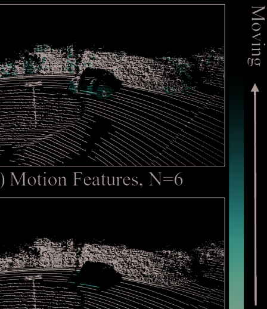

*图片来源: PDF 第 4 页, 文件名: page_04_img_2.png*

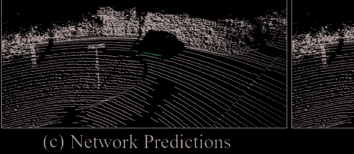

*图片来源: PDF 第 4 页, 文件名: page_04_img_3.png*

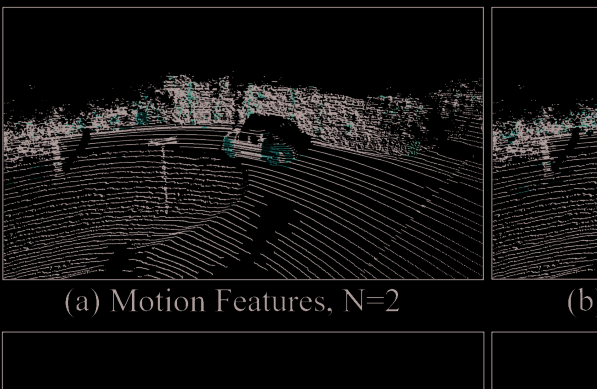

*图片来源: PDF 第 4 页, 文件名: page_04_img_4.png*

*图片来源: PDF 第 4 页, 文件名: page_04_img_5.png*

*图片来源: PDF 第 4 页, 文件名: page_04_img_6.png*

*图片来源: PDF 第 4 页, 文件名: page_04_img_7.png*

*图片来源: PDF 第 4 页, 文件名: page_04_img_8.png*

*图片来源: PDF 第 4 页, 文件名: page_04_img_9.png*

*图片来源: PDF 第 4 页, 文件名: page_04_img_10.png*

*图片来源: PDF 第 4 页, 文件名: page_04_img_11.png*

*图片来源: PDF 第 4 页, 文件名: page_04_img_12.png*

*图片来源: PDF 第 4 页, 文件名: page_04_img_13.png*

*图片来源: PDF 第 4 页, 文件名: page_04_img_14.png*

*图片来源: PDF 第 4 页, 文件名: page_04_img_15.png*

*图片来源: PDF 第 4 页, 文件名: page_04_img_16.png*

*图片来源: PDF 第 4 页, 文件名: page_04_img_17.png*

*图片来源: PDF 第 4 页, 文件名: page_04_img_18.png*

*图片来源: PDF 第 4 页, 文件名: page_04_img_19.png*

*图片来源: PDF 第 4 页, 文件名: page_04_img_20.png*

*图片来源: PDF 第 4 页, 文件名: page_04_img_21.png*

*图片来源: PDF 第 4 页, 文件名: page_04_img_22.png*

*图片来源: PDF 第 4 页, 文件名: page_04_img_23.png*

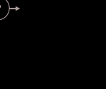

*图片来源: PDF 第 4 页, 文件名: page_04_img_24.png*

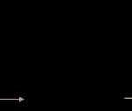

*图片来源: PDF 第 4 页, 文件名: page_04_img_25.png*

*图片来源: PDF 第 4 页, 文件名: page_04_img_26.png*

*图片来源: PDF 第 4 页, 文件名: page_04_img_27.png*

*图片来源: PDF 第 4 页, 文件名: page_04_img_28.png*

*图片来源: PDF 第 4 页, 文件名: page_04_img_29.png*

*图片来源: PDF 第 4 页, 文件名: page_04_img_30.png*

*图片来源: PDF 第 4 页, 文件名: page_04_img_31.png*

*图片来源: PDF 第 4 页, 文件名: page_04_img_32.png*

### 解析说明

[待解析：在此处填写对本节的中文解析]

---

## The framework of our proposed method is depicted in

*页码范围: 第 4 页开始*

Fig. 2. SegNet4D consists of four main components: Motion
Feature Encoding Module (Sec. III-A), Instance-Aware Fea-
ture Extraction Backbone (Sec. III-B), two separate output
heads (Sec. III-C), and Motion-Semantic Fusion Module
(MSFM, Sec. III-D). We specifically introduce each module
in the following section.
A. Motion Feature Encoding Module
4D semantic segmentation not only predicts the semantic
category for each point measured by LiDAR but also identifies
its motion state. Therefore, it is necessary to extract motion
features from the sequential point clouds. Existing methods
mainly utilize 4D convolution [26], [27] to obtain motion
cues, which poses a significant computational workload. To
improve the real-time performance, we adopt the BEV image
representation for fast motion feature encoding, as shown in
Fig. 3, which avoids computational expense processing on
extensive unstructured point cloud data. The encoding process
is divided into three steps as follows.
1) Point Cloud Alignment: To compensate for the ego-
motion of LiDAR, spatial alignment is conducted initially
on the input sequential point clouds. Specifically, given the
current point cloud S0 = {pi ∈ R4}M
i=1 consisting of M
points represented in homogeneous coordinates as pi
[xi, yi, zi, 1]T, along with the past N − 1 consecutive point=
clouds S1, S2, . . . , SN−1 with their relative transformations
T0
1, T1
2, . . . , TN−2
N−1, we transform the past N−1 consecutive point
clouds into the current viewpoint by
S j→0 = {p′
i = T0
j pi|pi ∈ S j}, T0
j=
j−1
Y
k=0
T j−k−1
j−k
.
(1)
Fig. 4. Motion features visualization. (a) and (b) represent the motion features
obtained from the current and past N-th scan. We compare the features with
the network’s predictions as well as ground truth.
In practical applications, the relative transformations can
be easily obtained through the existing LiDAR odome-

### 图片 (第 4 页)

*图片来源: PDF 第 4 页, 文件名: page_04_img_1.png*

*图片来源: PDF 第 4 页, 文件名: page_04_img_2.png*

*图片来源: PDF 第 4 页, 文件名: page_04_img_3.png*

*图片来源: PDF 第 4 页, 文件名: page_04_img_4.png*

*图片来源: PDF 第 4 页, 文件名: page_04_img_5.png*

*图片来源: PDF 第 4 页, 文件名: page_04_img_6.png*

*图片来源: PDF 第 4 页, 文件名: page_04_img_7.png*

*图片来源: PDF 第 4 页, 文件名: page_04_img_8.png*

*图片来源: PDF 第 4 页, 文件名: page_04_img_9.png*

*图片来源: PDF 第 4 页, 文件名: page_04_img_10.png*

*图片来源: PDF 第 4 页, 文件名: page_04_img_11.png*

*图片来源: PDF 第 4 页, 文件名: page_04_img_12.png*

*图片来源: PDF 第 4 页, 文件名: page_04_img_13.png*

*图片来源: PDF 第 4 页, 文件名: page_04_img_14.png*

*图片来源: PDF 第 4 页, 文件名: page_04_img_15.png*

*图片来源: PDF 第 4 页, 文件名: page_04_img_16.png*

*图片来源: PDF 第 4 页, 文件名: page_04_img_17.png*

*图片来源: PDF 第 4 页, 文件名: page_04_img_18.png*

*图片来源: PDF 第 4 页, 文件名: page_04_img_19.png*

*图片来源: PDF 第 4 页, 文件名: page_04_img_20.png*

*图片来源: PDF 第 4 页, 文件名: page_04_img_21.png*

*图片来源: PDF 第 4 页, 文件名: page_04_img_22.png*

*图片来源: PDF 第 4 页, 文件名: page_04_img_23.png*

*图片来源: PDF 第 4 页, 文件名: page_04_img_24.png*

*图片来源: PDF 第 4 页, 文件名: page_04_img_25.png*

*图片来源: PDF 第 4 页, 文件名: page_04_img_26.png*

*图片来源: PDF 第 4 页, 文件名: page_04_img_27.png*

*图片来源: PDF 第 4 页, 文件名: page_04_img_28.png*

*图片来源: PDF 第 4 页, 文件名: page_04_img_29.png*

*图片来源: PDF 第 4 页, 文件名: page_04_img_30.png*

*图片来源: PDF 第 4 页, 文件名: page_04_img_31.png*

*图片来源: PDF 第 4 页, 文件名: page_04_img_32.png*

### 解析说明

[待解析：在此处填写对本节的中文解析]

---

## try approach [4], [7]. We use the poses estimated by

*页码范围: 第 4 页开始*

SuMa [7].
2) BEV Projection: After alignment, we project the aligned
point clouds into single-channel BEV images. For each point
p′
j = (x′
j, y′
j, z′
j) ∈ S j→0, we first restrict it within x′
j ∈
[Xmin, Xmax], y′
j ∈ [Ymin, Ymax], z′
j ∈ [Zmin, Zmax] and then
convert it into the pillar space, given by
8
ˆˆˆˆ<
ˆˆˆˆ:
I(u,v), j = {z′
j|z′
j ∈ p′
j},
u = ⌊
x′
j − Xmin
g
⌋,
v = ⌊
y′
j − Ymin
g
⌋,
(2)
where I(u,v), j stores a set of point’s height in the pillar located
at (u, v), and g denotes grid resolution.
Following [25], we project the Ij into a single-channel BEV
image B j of size H×W. For each pixel value B(u,v),j, we use the
difference between the maximum and minimum height within
the same pillar, calculating as:
B(u,v), j = Max{I(u,v), j} − Min{I(u,v), j}
(3)
3) Motion
Features
Encoding:
We
take
the
BEV
residuals
R
∈
RH×W×(N−1)
between
B0
and
B1, . . . , BN−1 as the motion features in the BEV space,
calculated by
R(u,v), j→0 = B(u,v),0 − B(u,v),j, j ∈ 1, . . . , N − 1,
(4)
where R(u,v) represents the residual value for pixel at (u, v).
To obtain motion features for each point in the 3D space,
we perform back-projection by assigning the BEV residual
value to all points projected to the BEV pixel. Points within
the same pillar will share the same residual value for each
residual image. Finally, we obtain point-wise motion fea-
tures Fm ∈ RM×(N−1). We concatenate the Fm and current
scan’s spatial features, i.e., [x, y, z, intensity], generating a
new features Fsp ∈ RM×(N+3) as the input for subsequent
backbone.
The extracted motion features visualization is presented

### 图片 (第 4 页)

*图片来源: PDF 第 4 页, 文件名: page_04_img_1.png*

*图片来源: PDF 第 4 页, 文件名: page_04_img_2.png*

*图片来源: PDF 第 4 页, 文件名: page_04_img_3.png*

*图片来源: PDF 第 4 页, 文件名: page_04_img_4.png*

*图片来源: PDF 第 4 页, 文件名: page_04_img_5.png*

*图片来源: PDF 第 4 页, 文件名: page_04_img_6.png*

*图片来源: PDF 第 4 页, 文件名: page_04_img_7.png*

*图片来源: PDF 第 4 页, 文件名: page_04_img_8.png*

*图片来源: PDF 第 4 页, 文件名: page_04_img_9.png*

*图片来源: PDF 第 4 页, 文件名: page_04_img_10.png*

*图片来源: PDF 第 4 页, 文件名: page_04_img_11.png*

*图片来源: PDF 第 4 页, 文件名: page_04_img_12.png*

*图片来源: PDF 第 4 页, 文件名: page_04_img_13.png*

*图片来源: PDF 第 4 页, 文件名: page_04_img_14.png*

*图片来源: PDF 第 4 页, 文件名: page_04_img_15.png*

*图片来源: PDF 第 4 页, 文件名: page_04_img_16.png*

*图片来源: PDF 第 4 页, 文件名: page_04_img_17.png*

*图片来源: PDF 第 4 页, 文件名: page_04_img_18.png*

*图片来源: PDF 第 4 页, 文件名: page_04_img_19.png*

*图片来源: PDF 第 4 页, 文件名: page_04_img_20.png*

*图片来源: PDF 第 4 页, 文件名: page_04_img_21.png*

*图片来源: PDF 第 4 页, 文件名: page_04_img_22.png*

*图片来源: PDF 第 4 页, 文件名: page_04_img_23.png*

*图片来源: PDF 第 4 页, 文件名: page_04_img_24.png*

*图片来源: PDF 第 4 页, 文件名: page_04_img_25.png*

*图片来源: PDF 第 4 页, 文件名: page_04_img_26.png*

*图片来源: PDF 第 4 页, 文件名: page_04_img_27.png*

*图片来源: PDF 第 4 页, 文件名: page_04_img_28.png*

*图片来源: PDF 第 4 页, 文件名: page_04_img_29.png*

*图片来源: PDF 第 4 页, 文件名: page_04_img_30.png*

*图片来源: PDF 第 4 页, 文件名: page_04_img_31.png*

*图片来源: PDF 第 4 页, 文件名: page_04_img_32.png*

### 解析说明

[待解析：在此处填写对本节的中文解析]

---

## in Fig. 4. Our approach can obtain initial motion cues for

*页码范围: 第 4 页开始*

Authorized licensed use limited to: Hebei University of Technology. Downloaded on December 17,2025 at 07:34:24 UTC from IEEE Xplore.  Restrictions apply. 
WANG et al.: SegNet4D: EFFICIENT INSTANCE-AWARE 4D SEMANTIC SEGMENTATION
15343
Fig. 5. The architecture of the Instance-Aware Feature Extraction Backbone.
3 × 3 × 3 indicates a kernel size for 3D sparse convolution. [32,64,128,256]
represents the dimensions of the output feature channels. M and N are defined
in the motion feature encoding process. M′ denotes the number of non-empty
voxels in the last layer. O is the number of object detection categories.
moving objects in the scene. As the time interval for residual
computation extends, the motion features become increas-
ingly prominent. Inevitably, some points might be erroneously
assigned motion characteristics because of changes in LiDAR
viewpoint or inaccuracies in odometry estimation. However,
through our network’s subsequent learning process, which
utilizes the scene’s spatial features to distinguish movable from
immovable objects and learning multi-channel motion features
to identify true moving objects, these points still are correctly
categorized, as shown in the Fig. 4 (c). Our network is capable
of learning spatial features for semantic classification from
the current LiDAR scan, as well as motion cues for motion
segmentation. This is also a significant difference from purely
projection-based methods, as we still leverage valuable spatial
features inherent in the original point cloud.
B. Instance-Aware Feature Extraction Backbone
In semantic segmentation, over-segmentation is a common
issue, where a single instance is incorrectly divided into mul-
tiple segments. Especially in the MOS task, existing methods
lack instance awareness, often erroneously dividing an instance
into two different motion states. To tackle such issues, we
design the Instance-Aware Feature Extraction Backbone to
extract instances information and incorporate them into our
prediction pipeline. As shown in Fig. 5. It consists of the
Instance Detection Module and the Upsample Fusion Module.
1) Instance Detection Module: In this module, We use
3D sparse convolution blocks [34] to voxelize the current
point cloud and then perform convolution only on non-empty
voxels, greatly improving the processing speed. Moreover, to
capture more crucial features, we add a window self-attention
[35] layer after each sparse convolution block to improve the
receptive field. Our key finding is that instance information is
crucial for LiDAR segmentation, as also shown in panoptic
segmentation methods [36], [37]. However, these methods
typically require additional point-wise instance labels, which
may not always be accessible. To address this, we propose

### 图片 (第 4 页)

*图片来源: PDF 第 4 页, 文件名: page_04_img_1.png*

*图片来源: PDF 第 4 页, 文件名: page_04_img_2.png*

*图片来源: PDF 第 4 页, 文件名: page_04_img_3.png*

*图片来源: PDF 第 4 页, 文件名: page_04_img_4.png*

*图片来源: PDF 第 4 页, 文件名: page_04_img_5.png*

*图片来源: PDF 第 4 页, 文件名: page_04_img_6.png*

*图片来源: PDF 第 4 页, 文件名: page_04_img_7.png*

*图片来源: PDF 第 4 页, 文件名: page_04_img_8.png*

*图片来源: PDF 第 4 页, 文件名: page_04_img_9.png*

*图片来源: PDF 第 4 页, 文件名: page_04_img_10.png*

*图片来源: PDF 第 4 页, 文件名: page_04_img_11.png*

*图片来源: PDF 第 4 页, 文件名: page_04_img_12.png*

*图片来源: PDF 第 4 页, 文件名: page_04_img_13.png*

*图片来源: PDF 第 4 页, 文件名: page_04_img_14.png*

*图片来源: PDF 第 4 页, 文件名: page_04_img_15.png*

*图片来源: PDF 第 4 页, 文件名: page_04_img_16.png*

*图片来源: PDF 第 4 页, 文件名: page_04_img_17.png*

*图片来源: PDF 第 4 页, 文件名: page_04_img_18.png*

*图片来源: PDF 第 4 页, 文件名: page_04_img_19.png*

*图片来源: PDF 第 4 页, 文件名: page_04_img_20.png*

*图片来源: PDF 第 4 页, 文件名: page_04_img_21.png*

*图片来源: PDF 第 4 页, 文件名: page_04_img_22.png*

*图片来源: PDF 第 4 页, 文件名: page_04_img_23.png*

*图片来源: PDF 第 4 页, 文件名: page_04_img_24.png*

*图片来源: PDF 第 4 页, 文件名: page_04_img_25.png*

*图片来源: PDF 第 4 页, 文件名: page_04_img_26.png*

*图片来源: PDF 第 4 页, 文件名: page_04_img_27.png*

*图片来源: PDF 第 4 页, 文件名: page_04_img_28.png*

*图片来源: PDF 第 4 页, 文件名: page_04_img_29.png*

*图片来源: PDF 第 4 页, 文件名: page_04_img_30.png*

*图片来源: PDF 第 4 页, 文件名: page_04_img_31.png*

*图片来源: PDF 第 4 页, 文件名: page_04_img_32.png*

### 解析说明

[待解析：在此处填写对本节的中文解析]

---

## a method to automatically generate instance bounding boxes

*页码范围: 第 5 页开始*

using existing semantic annotations. This process begins by
generating each instance cluster from the semantic point cloud
using the Euclidean clustering algorithm in PCL library [38].
Subsequently, these clusters are projected into the BEV space,
and their orientation is determined using principal component
analysis (PCA) [39]. We then combine the height of the
cluster to obtain the minimum bounding box and further refine

### 图片 (第 5 页)

*图片来源: PDF 第 5 页, 文件名: page_05_img_1.png*

*图片来源: PDF 第 5 页, 文件名: page_05_img_2.png*

*图片来源: PDF 第 5 页, 文件名: page_05_img_3.png*

*图片来源: PDF 第 5 页, 文件名: page_05_img_4.png*

*图片来源: PDF 第 5 页, 文件名: page_05_img_5.png*

*图片来源: PDF 第 5 页, 文件名: page_05_img_6.png*

*图片来源: PDF 第 5 页, 文件名: page_05_img_7.png*

*图片来源: PDF 第 5 页, 文件名: page_05_img_8.png*

*图片来源: PDF 第 5 页, 文件名: page_05_img_9.png*

*图片来源: PDF 第 5 页, 文件名: page_05_img_10.png*

*图片来源: PDF 第 5 页, 文件名: page_05_img_11.png*

*图片来源: PDF 第 5 页, 文件名: page_05_img_12.png*

*图片来源: PDF 第 5 页, 文件名: page_05_img_13.png*

*图片来源: PDF 第 5 页, 文件名: page_05_img_14.png*

*图片来源: PDF 第 5 页, 文件名: page_05_img_15.png*

*图片来源: PDF 第 5 页, 文件名: page_05_img_16.png*

*图片来源: PDF 第 5 页, 文件名: page_05_img_17.png*

*图片来源: PDF 第 5 页, 文件名: page_05_img_18.png*

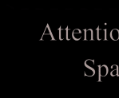

*图片来源: PDF 第 5 页, 文件名: page_05_img_19.png*

*图片来源: PDF 第 5 页, 文件名: page_05_img_20.png*

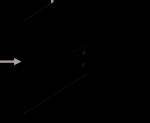

*图片来源: PDF 第 5 页, 文件名: page_05_img_21.png*

*图片来源: PDF 第 5 页, 文件名: page_05_img_22.png*

*图片来源: PDF 第 5 页, 文件名: page_05_img_23.png*

*图片来源: PDF 第 5 页, 文件名: page_05_img_24.png*

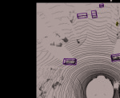

*图片来源: PDF 第 5 页, 文件名: page_05_img_25.png*

*图片来源: PDF 第 5 页, 文件名: page_05_img_26.png*

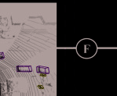

*图片来源: PDF 第 5 页, 文件名: page_05_img_27.png*

*图片来源: PDF 第 5 页, 文件名: page_05_img_28.png*

*图片来源: PDF 第 5 页, 文件名: page_05_img_29.png*

*图片来源: PDF 第 5 页, 文件名: page_05_img_30.png*

*图片来源: PDF 第 5 页, 文件名: page_05_img_31.png*

*图片来源: PDF 第 5 页, 文件名: page_05_img_32.png*

*图片来源: PDF 第 5 页, 文件名: page_05_img_33.png*

*图片来源: PDF 第 5 页, 文件名: page_05_img_34.png*

*图片来源: PDF 第 5 页, 文件名: page_05_img_35.png*

### 解析说明

[待解析：在此处填写对本节的中文解析]

---

## it by L-Shape method [40]. Finally, we utilize CenterHead

*页码范围: 第 5 页开始*

[41] trained with automatically generated instance labels, to
predict instance bounding boxes of O categories online, such
as cars, pedestrians, and cyclists. These predicted boxes are
then used to enhance feature extraction within our backbone,
as described in the upsample fusion module.
2) Upsample Fusion Module: To introduce instance con-
sistency into feature-level fusion, we find and extract points
within the instance bounding box as instance feature masks.
Subsequently, we concatenate it with the point embeddings
from the Instance Detection Module as input for the Upsample
Fusion Module. Unlike InsMOS [17], we integrate the instance
features only once to enhance efficiency. The Upsample Fusion
Module serves the main purpose of integrating instance fea-
tures into the prediction pipeline, as well as recovering the
scale of the features hierarchically through 3D deconvolution
blocks. It is formed by a fully U-Net network structure
together with the Instance Detection Module and main-
tains more details from different scale features through skip
connection.
C. Motion Head and Semantic Head
Existing 4D semantic segmentation methods usually predict
all semantic class labels in an end-to-end manner, including
those moving and static classes. However, since static points
typically outnumber moving ones in existing datasets, these

### 图片 (第 5 页)

*图片来源: PDF 第 5 页, 文件名: page_05_img_1.png*

*图片来源: PDF 第 5 页, 文件名: page_05_img_2.png*

*图片来源: PDF 第 5 页, 文件名: page_05_img_3.png*

*图片来源: PDF 第 5 页, 文件名: page_05_img_4.png*

*图片来源: PDF 第 5 页, 文件名: page_05_img_5.png*

*图片来源: PDF 第 5 页, 文件名: page_05_img_6.png*

*图片来源: PDF 第 5 页, 文件名: page_05_img_7.png*

*图片来源: PDF 第 5 页, 文件名: page_05_img_8.png*

*图片来源: PDF 第 5 页, 文件名: page_05_img_9.png*

*图片来源: PDF 第 5 页, 文件名: page_05_img_10.png*

*图片来源: PDF 第 5 页, 文件名: page_05_img_11.png*

*图片来源: PDF 第 5 页, 文件名: page_05_img_12.png*

*图片来源: PDF 第 5 页, 文件名: page_05_img_13.png*

*图片来源: PDF 第 5 页, 文件名: page_05_img_14.png*

*图片来源: PDF 第 5 页, 文件名: page_05_img_15.png*

*图片来源: PDF 第 5 页, 文件名: page_05_img_16.png*

*图片来源: PDF 第 5 页, 文件名: page_05_img_17.png*

*图片来源: PDF 第 5 页, 文件名: page_05_img_18.png*

*图片来源: PDF 第 5 页, 文件名: page_05_img_19.png*

*图片来源: PDF 第 5 页, 文件名: page_05_img_20.png*

*图片来源: PDF 第 5 页, 文件名: page_05_img_21.png*

*图片来源: PDF 第 5 页, 文件名: page_05_img_22.png*

*图片来源: PDF 第 5 页, 文件名: page_05_img_23.png*

*图片来源: PDF 第 5 页, 文件名: page_05_img_24.png*

*图片来源: PDF 第 5 页, 文件名: page_05_img_25.png*

*图片来源: PDF 第 5 页, 文件名: page_05_img_26.png*

*图片来源: PDF 第 5 页, 文件名: page_05_img_27.png*

*图片来源: PDF 第 5 页, 文件名: page_05_img_28.png*

*图片来源: PDF 第 5 页, 文件名: page_05_img_29.png*

*图片来源: PDF 第 5 页, 文件名: page_05_img_30.png*

*图片来源: PDF 第 5 页, 文件名: page_05_img_31.png*

*图片来源: PDF 第 5 页, 文件名: page_05_img_32.png*

*图片来源: PDF 第 5 页, 文件名: page_05_img_33.png*

*图片来源: PDF 第 5 页, 文件名: page_05_img_34.png*

*图片来源: PDF 第 5 页, 文件名: page_05_img_35.png*

### 解析说明

[待解析：在此处填写对本节的中文解析]

---

## approaches often result in suboptimal network performance in

*页码范围: 第 5 页开始*

identifying moving classes. So we employ two distinct heads
for predicting moving labels and single-scan semantic labels

### 图片 (第 5 页)

*图片来源: PDF 第 5 页, 文件名: page_05_img_1.png*

*图片来源: PDF 第 5 页, 文件名: page_05_img_2.png*

*图片来源: PDF 第 5 页, 文件名: page_05_img_3.png*

*图片来源: PDF 第 5 页, 文件名: page_05_img_4.png*

*图片来源: PDF 第 5 页, 文件名: page_05_img_5.png*

*图片来源: PDF 第 5 页, 文件名: page_05_img_6.png*

*图片来源: PDF 第 5 页, 文件名: page_05_img_7.png*

*图片来源: PDF 第 5 页, 文件名: page_05_img_8.png*

*图片来源: PDF 第 5 页, 文件名: page_05_img_9.png*

*图片来源: PDF 第 5 页, 文件名: page_05_img_10.png*

*图片来源: PDF 第 5 页, 文件名: page_05_img_11.png*

*图片来源: PDF 第 5 页, 文件名: page_05_img_12.png*

*图片来源: PDF 第 5 页, 文件名: page_05_img_13.png*

*图片来源: PDF 第 5 页, 文件名: page_05_img_14.png*

*图片来源: PDF 第 5 页, 文件名: page_05_img_15.png*

*图片来源: PDF 第 5 页, 文件名: page_05_img_16.png*

*图片来源: PDF 第 5 页, 文件名: page_05_img_17.png*

*图片来源: PDF 第 5 页, 文件名: page_05_img_18.png*

*图片来源: PDF 第 5 页, 文件名: page_05_img_19.png*

*图片来源: PDF 第 5 页, 文件名: page_05_img_20.png*

*图片来源: PDF 第 5 页, 文件名: page_05_img_21.png*

*图片来源: PDF 第 5 页, 文件名: page_05_img_22.png*

*图片来源: PDF 第 5 页, 文件名: page_05_img_23.png*

*图片来源: PDF 第 5 页, 文件名: page_05_img_24.png*

*图片来源: PDF 第 5 页, 文件名: page_05_img_25.png*

*图片来源: PDF 第 5 页, 文件名: page_05_img_26.png*

*图片来源: PDF 第 5 页, 文件名: page_05_img_27.png*

*图片来源: PDF 第 5 页, 文件名: page_05_img_28.png*

*图片来源: PDF 第 5 页, 文件名: page_05_img_29.png*

*图片来源: PDF 第 5 页, 文件名: page_05_img_30.png*

*图片来源: PDF 第 5 页, 文件名: page_05_img_31.png*

*图片来源: PDF 第 5 页, 文件名: page_05_img_32.png*

*图片来源: PDF 第 5 页, 文件名: page_05_img_33.png*

*图片来源: PDF 第 5 页, 文件名: page_05_img_34.png*

*图片来源: PDF 第 5 页, 文件名: page_05_img_35.png*

### 解析说明

[待解析：在此处填写对本节的中文解析]

---

## separately. By explicitly supervising MOS, our method can

*页码范围: 第 5 页开始*

maintain superior performance for moving object recognition.
To maintain the network’s lightweight characteristics, these
heads consist solely of a convolutional layer, a normalization
layer, an activation function layer, and a linear layer, which are
employed to further classify features with different attributes.
Finally, we can obtain point-wise motion features F′
m ∈ RM×16
and semantic features F′
s ∈ RM×32, which are utilized for the
subsequent fusion to enable 4D semantic segmentation. Where
16 and 32 denotes the number of feature channel. Naturally,
the motion head and semantic head also generate point-wise
motion predictions F′′
m ∈ RM×3 and semantic predictions F′′
s ∈
RM×C by applying an additional linear layer and a softmax
function. Note that 3 represents three different motion classes,
namely unlabeled, static, and moving, while C denotes the
number of static semantic categories. Each head is supervised
with a specific loss function. Further details are provided in
Sec. III-F.
D. Motion-Semantic Fusion Module
After obtaining motion labels and single-scan semantic

### 图片 (第 5 页)

*图片来源: PDF 第 5 页, 文件名: page_05_img_1.png*

*图片来源: PDF 第 5 页, 文件名: page_05_img_2.png*

*图片来源: PDF 第 5 页, 文件名: page_05_img_3.png*

*图片来源: PDF 第 5 页, 文件名: page_05_img_4.png*

*图片来源: PDF 第 5 页, 文件名: page_05_img_5.png*

*图片来源: PDF 第 5 页, 文件名: page_05_img_6.png*

*图片来源: PDF 第 5 页, 文件名: page_05_img_7.png*

*图片来源: PDF 第 5 页, 文件名: page_05_img_8.png*

*图片来源: PDF 第 5 页, 文件名: page_05_img_9.png*

*图片来源: PDF 第 5 页, 文件名: page_05_img_10.png*

*图片来源: PDF 第 5 页, 文件名: page_05_img_11.png*

*图片来源: PDF 第 5 页, 文件名: page_05_img_12.png*

*图片来源: PDF 第 5 页, 文件名: page_05_img_13.png*

*图片来源: PDF 第 5 页, 文件名: page_05_img_14.png*

*图片来源: PDF 第 5 页, 文件名: page_05_img_15.png*

*图片来源: PDF 第 5 页, 文件名: page_05_img_16.png*

*图片来源: PDF 第 5 页, 文件名: page_05_img_17.png*

*图片来源: PDF 第 5 页, 文件名: page_05_img_18.png*

*图片来源: PDF 第 5 页, 文件名: page_05_img_19.png*

*图片来源: PDF 第 5 页, 文件名: page_05_img_20.png*

*图片来源: PDF 第 5 页, 文件名: page_05_img_21.png*

*图片来源: PDF 第 5 页, 文件名: page_05_img_22.png*

*图片来源: PDF 第 5 页, 文件名: page_05_img_23.png*

*图片来源: PDF 第 5 页, 文件名: page_05_img_24.png*

*图片来源: PDF 第 5 页, 文件名: page_05_img_25.png*

*图片来源: PDF 第 5 页, 文件名: page_05_img_26.png*

*图片来源: PDF 第 5 页, 文件名: page_05_img_27.png*

*图片来源: PDF 第 5 页, 文件名: page_05_img_28.png*

*图片来源: PDF 第 5 页, 文件名: page_05_img_29.png*

*图片来源: PDF 第 5 页, 文件名: page_05_img_30.png*

*图片来源: PDF 第 5 页, 文件名: page_05_img_31.png*

*图片来源: PDF 第 5 页, 文件名: page_05_img_32.png*

*图片来源: PDF 第 5 页, 文件名: page_05_img_33.png*

*图片来源: PDF 第 5 页, 文件名: page_05_img_34.png*

*图片来源: PDF 第 5 页, 文件名: page_05_img_35.png*

### 解析说明

[待解析：在此处填写对本节的中文解析]

---

## labels, a straightforward approach to achieve 4D semantic

*页码范围: 第 5 页开始*

Authorized licensed use limited to: Hebei University of Technology. Downloaded on December 17,2025 at 07:34:24 UTC from IEEE Xplore.  Restrictions apply. 
15344
IEEE TRANSACTIONS ON AUTOMATION SCIENCE AND ENGINEERING, VOL. 22, 2025
Fig. 6.
The architecture of Motion-Semantic Fusion Module. We mainly
perform spatial attention and channel attention to fuse the motion features
and the static semantic features.
segmentation is to fuse them by checking the motion states
on each semantic point. However, this fashion may yield
non-smooth point segmentation. Moreover, incorrect motion
predictions directly lead to false 4D semantic segmentation

### 图片 (第 5 页)

*图片来源: PDF 第 5 页, 文件名: page_05_img_1.png*

*图片来源: PDF 第 5 页, 文件名: page_05_img_2.png*

*图片来源: PDF 第 5 页, 文件名: page_05_img_3.png*

*图片来源: PDF 第 5 页, 文件名: page_05_img_4.png*

*图片来源: PDF 第 5 页, 文件名: page_05_img_5.png*

*图片来源: PDF 第 5 页, 文件名: page_05_img_6.png*

*图片来源: PDF 第 5 页, 文件名: page_05_img_7.png*

*图片来源: PDF 第 5 页, 文件名: page_05_img_8.png*

*图片来源: PDF 第 5 页, 文件名: page_05_img_9.png*

*图片来源: PDF 第 5 页, 文件名: page_05_img_10.png*

*图片来源: PDF 第 5 页, 文件名: page_05_img_11.png*

*图片来源: PDF 第 5 页, 文件名: page_05_img_12.png*

*图片来源: PDF 第 5 页, 文件名: page_05_img_13.png*

*图片来源: PDF 第 5 页, 文件名: page_05_img_14.png*

*图片来源: PDF 第 5 页, 文件名: page_05_img_15.png*

*图片来源: PDF 第 5 页, 文件名: page_05_img_16.png*

*图片来源: PDF 第 5 页, 文件名: page_05_img_17.png*

*图片来源: PDF 第 5 页, 文件名: page_05_img_18.png*

*图片来源: PDF 第 5 页, 文件名: page_05_img_19.png*

*图片来源: PDF 第 5 页, 文件名: page_05_img_20.png*

*图片来源: PDF 第 5 页, 文件名: page_05_img_21.png*

*图片来源: PDF 第 5 页, 文件名: page_05_img_22.png*

*图片来源: PDF 第 5 页, 文件名: page_05_img_23.png*

*图片来源: PDF 第 5 页, 文件名: page_05_img_24.png*

*图片来源: PDF 第 5 页, 文件名: page_05_img_25.png*

*图片来源: PDF 第 5 页, 文件名: page_05_img_26.png*

*图片来源: PDF 第 5 页, 文件名: page_05_img_27.png*

*图片来源: PDF 第 5 页, 文件名: page_05_img_28.png*

*图片来源: PDF 第 5 页, 文件名: page_05_img_29.png*

*图片来源: PDF 第 5 页, 文件名: page_05_img_30.png*

*图片来源: PDF 第 5 页, 文件名: page_05_img_31.png*

*图片来源: PDF 第 5 页, 文件名: page_05_img_32.png*

*图片来源: PDF 第 5 页, 文件名: page_05_img_33.png*

*图片来源: PDF 第 5 页, 文件名: page_05_img_34.png*

*图片来源: PDF 第 5 页, 文件名: page_05_img_35.png*

### 解析说明

[待解析：在此处填写对本节的中文解析]

---

## results. We hence propose a motion-semantic fusion module

*页码范围: 第 6 页开始*

to further integrate motion features F′
m and static semantic
features F′
s for achieving motion-guided 4D semantic segmen-
tation. Details of this module are illustrated in Fig. 6.
We build our Motion-Semantic Fusion Module upon
recently advanced motion-guided attention module [42] in the
field of image processing. We extend it into 3D space and
mainly utilize the 3D submanifold sparse convolution [34] as
the backbone for performing spatial attention between the F′
s
with F′
m as:
F′
sm = F′
s ⊗ Sigmoid(3DConv1×1×1(F′
m)),
(5)
where
⊗
represent
element-wise
multiplication,
3DConv1×1×1(·)
represent
a
3D
submanifold
sparse
convolution with 1×1×1 kernel size, and F′
sm ∈ RM×D are the
fused motion-salient features, and D denotes the number of
feature channels. We then perform channel attention for F′
sm
to strengthen the responses of key attributes. Subsequently,
it is element-wisely added by F′
s because the static semantic
features are equally crucial for the 4D semantic segmentation.
The final F′′
sm is calculated as:
F′′
sm=F′
sm ⊗ [Softmax(2DConv1×1(AvgPool(F′
sm))) · D] + F′
s,
(6)
where 2DConv1×1(·) and AvgPool(·) denote a 2D convolution
with 1 × 1 kernel size and average pooling operation, respec-
tively. 2D convolution is mainly used to quickly calculate
channel attention weights, which is different from using 3D
convolution for spatial attention as mentioned earlier.
Finally, we further refine F′′
sm using 3D sparse convolutions
and channel attention blocks [43] to generate the final 4D
semantic segmentation predictions F′′
s ∈ RM×C′, where C′ is
the number of categories for 4D semantic segmentation.
E. Moving Instance Refinement
To further enhance the accuracy of MOS, we check again
the point-wise predictions within the instance bounding box
and propose an instance-aware post-processing algorithm for
point-level refinement, combining in a bottom-up and top-
down fashion.

### 图片 (第 6 页)

*图片来源: PDF 第 6 页, 文件名: page_06_img_1.png*

*图片来源: PDF 第 6 页, 文件名: page_06_img_2.png*

*图片来源: PDF 第 6 页, 文件名: page_06_img_3.png*

*图片来源: PDF 第 6 页, 文件名: page_06_img_4.png*

*图片来源: PDF 第 6 页, 文件名: page_06_img_5.png*

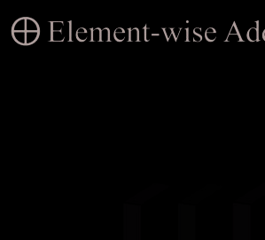

*图片来源: PDF 第 6 页, 文件名: page_06_img_6.png*

*图片来源: PDF 第 6 页, 文件名: page_06_img_7.png*

### 解析说明

[待解析：在此处填写对本节的中文解析]

---

## This bottom-up aims to refine the results of the follow-

*页码范围: 第 6 页开始*

ing second cases. Firstly, if many points within an instance
are moving, then the instance is considered to be moving.
Secondly, if the scene contains many moving vehicles, it is
considered as a highly dynamic scene, such as the highway.
Vehicles in this scene will be more easily classified as the
moving class with a lower confidence threshold. During the
top-down step, when an instance is identified as moving, all
points within the instance are determined as moving, which
is natural when considering each instance as a rigid body.
Besides, because motion is a continuous process, we consider
an instance to be moving only when classified as a moving
class in multiple observations. The details for the algorithmic
process please refer to our previous conference paper [17].
F. Loss Function
Due to multi-task setup, our loss function includes instance
detection loss Ldet, MOS loss Lmos, SSS loss Ls sem and
4D semantic segmentation loss L4D sem. In order to achieve
a balance between the magnitudes of different loss func-
tions and to expedite the convergence speed, we apply a
weighted multi-task loss [44] Ltotal to supervise the training,
defined as:
Ltotal =
X
i∈{det,mos,s sem,4D sem}
1
2σ2
i
Li + ln
�
1 + σ2
i
�
,
(7)
where σi is a learnable parameter used to represent the
uncertainty of Li. Ldet is composed of instance classification
loss and bounding box regression loss. More details can be
found in the CenterHead [41]. In addition, we employ the
widely used weighed Cross-Entropy Loss function [22] for
Lmos, Ls sem and L4D sem:
L{mos,s sem,m sem}(y, ˆy) = −
X
αip (yi) log (p (ˆyi)) , αi = 1/
p
fi,
(8)
where yi and ˆyi denote the ground truth and the predicted
labels, respectively. fi is the frequency of the i-th class.
IV. EXPERIMENTAL EVALUATION

### 图片 (第 6 页)

*图片来源: PDF 第 6 页, 文件名: page_06_img_1.png*

*图片来源: PDF 第 6 页, 文件名: page_06_img_2.png*

*图片来源: PDF 第 6 页, 文件名: page_06_img_3.png*

*图片来源: PDF 第 6 页, 文件名: page_06_img_4.png*

*图片来源: PDF 第 6 页, 文件名: page_06_img_5.png*

*图片来源: PDF 第 6 页, 文件名: page_06_img_6.png*

*图片来源: PDF 第 6 页, 文件名: page_06_img_7.png*

### 解析说明

[待解析：在此处填写对本节的中文解析]

---

## In this section, we conduct a series of experiments on

*页码范围: 第 6 页开始*

SemanticKITTI [14] and nuScenes [45] datasets to demon-
strate SegNet4D’s capabilities on 4D semantic segmentation
(Sec. IV-A) and MOS (Sec. IV-B) and compare the perfor-

### 图片 (第 6 页)

*图片来源: PDF 第 6 页, 文件名: page_06_img_1.png*

*图片来源: PDF 第 6 页, 文件名: page_06_img_2.png*

*图片来源: PDF 第 6 页, 文件名: page_06_img_3.png*

*图片来源: PDF 第 6 页, 文件名: page_06_img_4.png*

*图片来源: PDF 第 6 页, 文件名: page_06_img_5.png*

*图片来源: PDF 第 6 页, 文件名: page_06_img_6.png*

*图片来源: PDF 第 6 页, 文件名: page_06_img_7.png*

### 解析说明

[待解析：在此处填写对本节的中文解析]

---

## mance with SOTA. Subsequently, we integrate the method into

*页码范围: 第 6 页开始*

a real robotic platform (Sec. IV-C), highlighting its practical

### 图片 (第 6 页)

*图片来源: PDF 第 6 页, 文件名: page_06_img_1.png*

*图片来源: PDF 第 6 页, 文件名: page_06_img_2.png*

*图片来源: PDF 第 6 页, 文件名: page_06_img_3.png*

*图片来源: PDF 第 6 页, 文件名: page_06_img_4.png*

*图片来源: PDF 第 6 页, 文件名: page_06_img_5.png*

*图片来源: PDF 第 6 页, 文件名: page_06_img_6.png*

*图片来源: PDF 第 6 页, 文件名: page_06_img_7.png*

### 解析说明

[待解析：在此处填写对本节的中文解析]

---

## utility. Besides, we perform ablation experiments to evaluate

*页码范围: 第 6 页开始*

the effectiveness of the framework and the proposed modules
(Sec. IV-D). Finally, we also conduct a detailed runtime

### 图片 (第 6 页)

*图片来源: PDF 第 6 页, 文件名: page_06_img_1.png*

*图片来源: PDF 第 6 页, 文件名: page_06_img_2.png*

*图片来源: PDF 第 6 页, 文件名: page_06_img_3.png*

*图片来源: PDF 第 6 页, 文件名: page_06_img_4.png*

*图片来源: PDF 第 6 页, 文件名: page_06_img_5.png*

*图片来源: PDF 第 6 页, 文件名: page_06_img_6.png*

*图片来源: PDF 第 6 页, 文件名: page_06_img_7.png*

### 解析说明

[待解析：在此处填写对本节的中文解析]

---

## IV-E). These experimental results will substantiate our claims

*页码范围: 第 6 页开始*

regarding the contributions.
1) Datasets-SemanticKITTI [14]: SemanticKITTI provides
semantic labels for each individual LiDAR scan in the KITTI
[46] odometry dataset, which comprises 22 sequences col-
lected with a Velodyne HDL-64E LiDAR. Following previous
Authorized licensed use limited to: Hebei University of Technology. Downloaded on December 17,2025 at 07:34:24 UTC from IEEE Xplore.  Restrictions apply. 
WANG et al.: SegNet4D: EFFICIENT INSTANCE-AWARE 4D SEMANTIC SEGMENTATION
15345
TABLE I
4D SEMANTIC SEGMENTATION PERFORMANCE EVALUATION ON THE SEMANTICKITTI BENCHMARK (MULTI-SCAN PHASE).

### 图片 (第 6 页)

*图片来源: PDF 第 6 页, 文件名: page_06_img_1.png*

*图片来源: PDF 第 6 页, 文件名: page_06_img_2.png*

*图片来源: PDF 第 6 页, 文件名: page_06_img_3.png*

*图片来源: PDF 第 6 页, 文件名: page_06_img_4.png*

*图片来源: PDF 第 6 页, 文件名: page_06_img_5.png*

*图片来源: PDF 第 6 页, 文件名: page_06_img_6.png*

*图片来源: PDF 第 6 页, 文件名: page_06_img_7.png*

### 解析说明

[待解析：在此处填写对本节的中文解析]

---

## “MOV.” DENOTES MOVING. THE BEST RESULTS ARE IN BOLD

*页码范围: 第 7 页开始*

work [1], [28], we use the standard data split where sequences
00 to 10 are used for training (with sequence 08 for val-
idation), and sequences 11 to 21 for testing. The dataset
contains multiple semantic category labels, and the semantic
segmentation task is officially divided into two phases. One
is the single-scan phase training 19 semantic classes without
distinguishing point-wise dynamic attributes. The other is the
multi-scan phase, which includes 25 semantic categories that
distinguish between moving and static objects. To evaluate the
4D semantic segmentation performance of our SegNet4D, we
test it in the multi-scan phase. In our model, the training is
supervised with 26 semantic categories, including 6 moving
classes, 19 static classes, and one outlier class. For the MOS
task, All the semantic categories are reorganized into two
classes: moving and static [21], [26]. Due to the imbalanced
distribution of moving objects between the training and test
set, an additional dataset, KITTI-Road, is introduced in [22]
to mitigate the impact. We follow the experimental setups
described in [22] to test the MOS performance.
2) Datasets-nuScenes [45]: It consists of 1000 driving
scenes collected with a 32-beam LiDAR sensor. For point
cloud segmentation tasks, it is mainly used for evaluat-
ing SSS with 16 static semantic classes. To achieve 4D
segmentation evaluation, inspired by [13], we utilize the
annotated bounding box motion attributes to generate 8
new moving categories, including moving car, moving bus,
moving truck, moving construction vehicle, moving trailer,
moving motorcyclist, moving bicyclist, and moving person.
This is a new multi-scan phase similar to SemanticKITTI. We
have released the multi-scan semantic segmentation dataset
of nuScenes for the convenience of the community. For
evaluating MOS, we divide all semantic categories into two
classes (moving and static).
3) Implementation Details: We restrict the point cloud range
in [x : ±60m, y : ±50m, z : −4m ∼ 2m] for SemanticKITTI,
[x : ±50m,
y : ±50m,
z : −4m ∼ 2m] for nuScenes,
and set g = 0.1m for encoding motion features. For 4D
semantic segmentation, we set C = 20,C′ = 26, O = 3 for
SemanticKITTI and C = 17,C′ = 25, O = 10 for nuScenes.
The proposed model is built on the PyTorch [47] library and
trained with 4 NVIDIA RTX 3090 GPUs. We set the batch
size to 8 on a single GPU and train the network for a total
of 80 epochs. The learning rate is initialized as 10−4 in the
Adam optimizer [48] and a decay factor of 0.01 for each
epoch. During the training process, we employ widely-used
data augmentation techniques such as random flipping, scaling,
and rotation to improve model performance.
4) Evaluation Metrics: For MOS performance evaluation,
we use the Intersection-over-Union (IoU) [49] of moving
objects as the metric:
IoU =
TP
TP + FP + FN,
(9)
where TP, FP, and FN represent the predictions of the moving
class that are classified as true positive, false positive, and false
negative, respectively. For 4D semantic segmentation, we use
the mean Intersection-over-Union (mIoU) across all categories
as the evaluation metric.
A. Evaluation for 4D Semantic Segmentation
We evaluate the 4D semantic segmentation performance

### 解析说明

[待解析：在此处填写对本节的中文解析]

---

## of our approach on the SemanticKITTI multi-scan semantic

*页码范围: 第 7 页开始*

segmentation benchmark and nuScenes dataset, and compare

### 解析说明

[待解析：在此处填写对本节的中文解析]

---

## the results with LiDAR-only SOTA baselines, including (a)

*页码范围: 第 7 页开始*

single-scan-based methods (stack historical LiDAR scans into
a single point cloud as input for multi-scans semantic segmen-
tation): KPConv [9], Cylinder3D [1]; and specially designed
multi-scans semantic segmentation methods: SpSequenceNet
[11], TemporalLidarSeg [12], MarS3D [13], SVQNet [30]
and MemorySeg [28]. Like all methods, we only utilize the
past two LiDAR scans to predict semantic labels for a fair
comparison, i.e., N = 3.

### 解析说明

[待解析：在此处填写对本节的中文解析]

---

## approach achieves a mIoU of 60.9% on the SemanticKITTI

*页码范围: 第 7 页开始*

dataset and outperforms all methods, demonstrating its effec-
tiveness. For semantic class bicyclist and motorcyclist, our
SegNet4D obtains a significant improvement, indicating that
the incorporation of instance information enables our model
to identify these foreground points more effectively. Besides,

### 解析说明

[待解析：在此处填写对本节的中文解析]

---

## approach capable of real-time operation on the SemanticKITTI

*页码范围: 第 7 页开始*

Authorized licensed use limited to: Hebei University of Technology. Downloaded on December 17,2025 at 07:34:24 UTC from IEEE Xplore.  Restrictions apply. 
15346
IEEE TRANSACTIONS ON AUTOMATION SCIENCE AND ENGINEERING, VOL. 22, 2025
TABLE II
4D SEMANTIC SEGMENTATION PERFORMANCE EVALUATION ON THE NUSCENES DATASET. “MOV.” DENOTES MOVING

### 解析说明

[待解析：在此处填写对本节的中文解析]

---

## Fig. 7. The qualitative results comparison between our approach and MarS3D on the nuScenes dataset.

*页码范围: 第 8 页开始*

dataset, showing its highly efficient for 4D LiDAR semantic
segmentation. For more runtime analysis, please refer to
Sec. IV-E.

### 图片 (第 8 页)

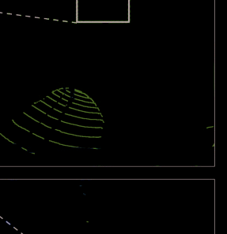

*图片来源: PDF 第 8 页, 文件名: page_08_img_1.png*

*图片来源: PDF 第 8 页, 文件名: page_08_img_2.png*

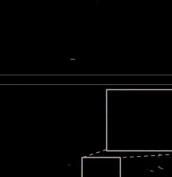

*图片来源: PDF 第 8 页, 文件名: page_08_img_3.png*

*图片来源: PDF 第 8 页, 文件名: page_08_img_4.png*

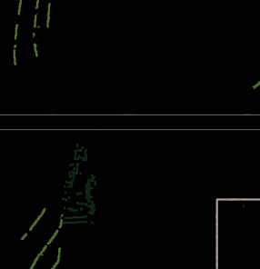

*图片来源: PDF 第 8 页, 文件名: page_08_img_5.png*

*图片来源: PDF 第 8 页, 文件名: page_08_img_6.png*

*图片来源: PDF 第 8 页, 文件名: page_08_img_7.png*

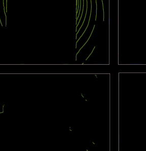

*图片来源: PDF 第 8 页, 文件名: page_08_img_8.png*

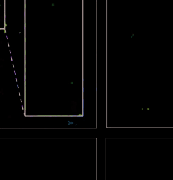

*图片来源: PDF 第 8 页, 文件名: page_08_img_9.png*

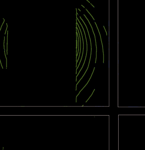

*图片来源: PDF 第 8 页, 文件名: page_08_img_10.png*

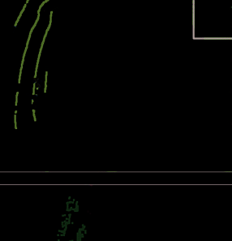

*图片来源: PDF 第 8 页, 文件名: page_08_img_11.png*

*图片来源: PDF 第 8 页, 文件名: page_08_img_12.png*

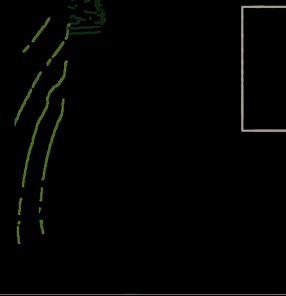

*图片来源: PDF 第 8 页, 文件名: page_08_img_13.png*

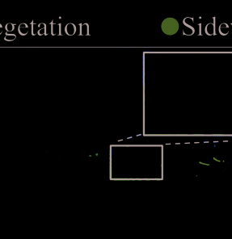

*图片来源: PDF 第 8 页, 文件名: page_08_img_14.png*

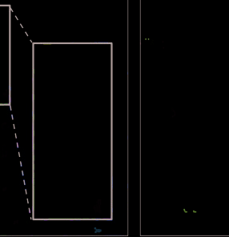

*图片来源: PDF 第 8 页, 文件名: page_08_img_15.png*

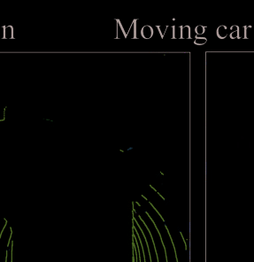

*图片来源: PDF 第 8 页, 文件名: page_08_img_16.png*

*图片来源: PDF 第 8 页, 文件名: page_08_img_17.png*

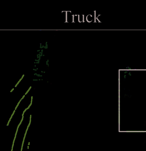

*图片来源: PDF 第 8 页, 文件名: page_08_img_18.png*

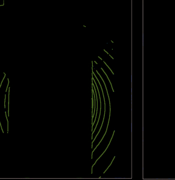

*图片来源: PDF 第 8 页, 文件名: page_08_img_19.png*

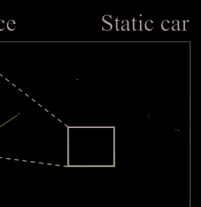

*图片来源: PDF 第 8 页, 文件名: page_08_img_20.png*

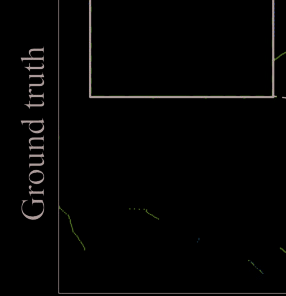

*图片来源: PDF 第 8 页, 文件名: page_08_img_21.png*

*图片来源: PDF 第 8 页, 文件名: page_08_img_22.png*

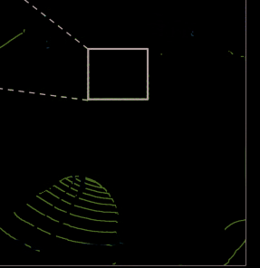

*图片来源: PDF 第 8 页, 文件名: page_08_img_23.png*

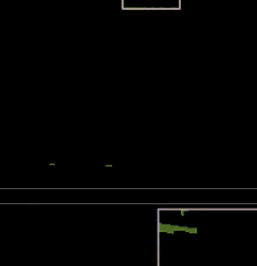

*图片来源: PDF 第 8 页, 文件名: page_08_img_24.png*

*图片来源: PDF 第 8 页, 文件名: page_08_img_25.png*

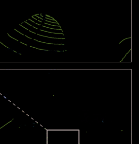

*图片来源: PDF 第 8 页, 文件名: page_08_img_26.png*

*图片来源: PDF 第 8 页, 文件名: page_08_img_27.png*

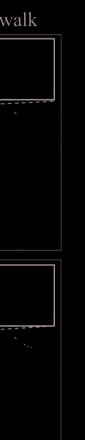

*图片来源: PDF 第 8 页, 文件名: page_08_img_28.png*

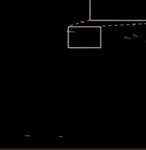

*图片来源: PDF 第 8 页, 文件名: page_08_img_29.png*

*图片来源: PDF 第 8 页, 文件名: page_08_img_30.png*

### 解析说明

[待解析：在此处填写对本节的中文解析]

---

## Additionally, we further evaluate our approach on the

*页码范围: 第 8 页开始*

nuScenes datasets and compare the performance with other
baselines. Note that some methods in the Tab. I is not
open-source, preventing their evaluation in the nuScenes multi-
scan phase. This also further highlights the contribution of
our open-source release in supporting community research.

### 图片 (第 8 页)

*图片来源: PDF 第 8 页, 文件名: page_08_img_1.png*

*图片来源: PDF 第 8 页, 文件名: page_08_img_2.png*

*图片来源: PDF 第 8 页, 文件名: page_08_img_3.png*

*图片来源: PDF 第 8 页, 文件名: page_08_img_4.png*

*图片来源: PDF 第 8 页, 文件名: page_08_img_5.png*

*图片来源: PDF 第 8 页, 文件名: page_08_img_6.png*

*图片来源: PDF 第 8 页, 文件名: page_08_img_7.png*

*图片来源: PDF 第 8 页, 文件名: page_08_img_8.png*

*图片来源: PDF 第 8 页, 文件名: page_08_img_9.png*

*图片来源: PDF 第 8 页, 文件名: page_08_img_10.png*

*图片来源: PDF 第 8 页, 文件名: page_08_img_11.png*

*图片来源: PDF 第 8 页, 文件名: page_08_img_12.png*

*图片来源: PDF 第 8 页, 文件名: page_08_img_13.png*

*图片来源: PDF 第 8 页, 文件名: page_08_img_14.png*

*图片来源: PDF 第 8 页, 文件名: page_08_img_15.png*

*图片来源: PDF 第 8 页, 文件名: page_08_img_16.png*

*图片来源: PDF 第 8 页, 文件名: page_08_img_17.png*

*图片来源: PDF 第 8 页, 文件名: page_08_img_18.png*

*图片来源: PDF 第 8 页, 文件名: page_08_img_19.png*

*图片来源: PDF 第 8 页, 文件名: page_08_img_20.png*

*图片来源: PDF 第 8 页, 文件名: page_08_img_21.png*

*图片来源: PDF 第 8 页, 文件名: page_08_img_22.png*

*图片来源: PDF 第 8 页, 文件名: page_08_img_23.png*

*图片来源: PDF 第 8 页, 文件名: page_08_img_24.png*

*图片来源: PDF 第 8 页, 文件名: page_08_img_25.png*

*图片来源: PDF 第 8 页, 文件名: page_08_img_26.png*

*图片来源: PDF 第 8 页, 文件名: page_08_img_27.png*

*图片来源: PDF 第 8 页, 文件名: page_08_img_28.png*

*图片来源: PDF 第 8 页, 文件名: page_08_img_29.png*

*图片来源: PDF 第 8 页, 文件名: page_08_img_30.png*

### 解析说明

[待解析：在此处填写对本节的中文解析]

---

## As shown in Tab. II, our method consistently delivers the

*页码范围: 第 8 页开始*

best performance, demonstrating its adaptability to different
types of LiDAR and scene changes. The qualitative com-
parison with MarS3D, as illustrated in Fig. 7, reveals our

### 图片 (第 8 页)

*图片来源: PDF 第 8 页, 文件名: page_08_img_1.png*

*图片来源: PDF 第 8 页, 文件名: page_08_img_2.png*

*图片来源: PDF 第 8 页, 文件名: page_08_img_3.png*

*图片来源: PDF 第 8 页, 文件名: page_08_img_4.png*

*图片来源: PDF 第 8 页, 文件名: page_08_img_5.png*

*图片来源: PDF 第 8 页, 文件名: page_08_img_6.png*

*图片来源: PDF 第 8 页, 文件名: page_08_img_7.png*

*图片来源: PDF 第 8 页, 文件名: page_08_img_8.png*

*图片来源: PDF 第 8 页, 文件名: page_08_img_9.png*

*图片来源: PDF 第 8 页, 文件名: page_08_img_10.png*

*图片来源: PDF 第 8 页, 文件名: page_08_img_11.png*

*图片来源: PDF 第 8 页, 文件名: page_08_img_12.png*

*图片来源: PDF 第 8 页, 文件名: page_08_img_13.png*

*图片来源: PDF 第 8 页, 文件名: page_08_img_14.png*

*图片来源: PDF 第 8 页, 文件名: page_08_img_15.png*

*图片来源: PDF 第 8 页, 文件名: page_08_img_16.png*

*图片来源: PDF 第 8 页, 文件名: page_08_img_17.png*

*图片来源: PDF 第 8 页, 文件名: page_08_img_18.png*

*图片来源: PDF 第 8 页, 文件名: page_08_img_19.png*

*图片来源: PDF 第 8 页, 文件名: page_08_img_20.png*

*图片来源: PDF 第 8 页, 文件名: page_08_img_21.png*

*图片来源: PDF 第 8 页, 文件名: page_08_img_22.png*

*图片来源: PDF 第 8 页, 文件名: page_08_img_23.png*

*图片来源: PDF 第 8 页, 文件名: page_08_img_24.png*

*图片来源: PDF 第 8 页, 文件名: page_08_img_25.png*

*图片来源: PDF 第 8 页, 文件名: page_08_img_26.png*

*图片来源: PDF 第 8 页, 文件名: page_08_img_27.png*

*图片来源: PDF 第 8 页, 文件名: page_08_img_28.png*

*图片来源: PDF 第 8 页, 文件名: page_08_img_29.png*

*图片来源: PDF 第 8 页, 文件名: page_08_img_30.png*

### 解析说明

[待解析：在此处填写对本节的中文解析]

---

## approach’s superior ability for moving object recognition.

*页码范围: 第 8 页开始*

This is also further corroborated by quantitative analyses

### 图片 (第 8 页)

*图片来源: PDF 第 8 页, 文件名: page_08_img_1.png*

*图片来源: PDF 第 8 页, 文件名: page_08_img_2.png*

*图片来源: PDF 第 8 页, 文件名: page_08_img_3.png*

*图片来源: PDF 第 8 页, 文件名: page_08_img_4.png*

*图片来源: PDF 第 8 页, 文件名: page_08_img_5.png*

*图片来源: PDF 第 8 页, 文件名: page_08_img_6.png*

*图片来源: PDF 第 8 页, 文件名: page_08_img_7.png*

*图片来源: PDF 第 8 页, 文件名: page_08_img_8.png*

*图片来源: PDF 第 8 页, 文件名: page_08_img_9.png*

*图片来源: PDF 第 8 页, 文件名: page_08_img_10.png*

*图片来源: PDF 第 8 页, 文件名: page_08_img_11.png*

*图片来源: PDF 第 8 页, 文件名: page_08_img_12.png*

*图片来源: PDF 第 8 页, 文件名: page_08_img_13.png*

*图片来源: PDF 第 8 页, 文件名: page_08_img_14.png*

*图片来源: PDF 第 8 页, 文件名: page_08_img_15.png*

*图片来源: PDF 第 8 页, 文件名: page_08_img_16.png*

*图片来源: PDF 第 8 页, 文件名: page_08_img_17.png*

*图片来源: PDF 第 8 页, 文件名: page_08_img_18.png*

*图片来源: PDF 第 8 页, 文件名: page_08_img_19.png*

*图片来源: PDF 第 8 页, 文件名: page_08_img_20.png*

*图片来源: PDF 第 8 页, 文件名: page_08_img_21.png*

*图片来源: PDF 第 8 页, 文件名: page_08_img_22.png*

*图片来源: PDF 第 8 页, 文件名: page_08_img_23.png*

*图片来源: PDF 第 8 页, 文件名: page_08_img_24.png*

*图片来源: PDF 第 8 页, 文件名: page_08_img_25.png*

*图片来源: PDF 第 8 页, 文件名: page_08_img_26.png*

*图片来源: PDF 第 8 页, 文件名: page_08_img_27.png*

*图片来源: PDF 第 8 页, 文件名: page_08_img_28.png*

*图片来源: PDF 第 8 页, 文件名: page_08_img_29.png*

*图片来源: PDF 第 8 页, 文件名: page_08_img_30.png*

### 解析说明

[待解析：在此处填写对本节的中文解析]

---

## presented in the Sec. IV-B. Additionally, our method exhibits

*页码范围: 第 8 页开始*

complete segmentation for big instances, like trucks, con-

### 图片 (第 8 页)

*图片来源: PDF 第 8 页, 文件名: page_08_img_1.png*

*图片来源: PDF 第 8 页, 文件名: page_08_img_2.png*

*图片来源: PDF 第 8 页, 文件名: page_08_img_3.png*

*图片来源: PDF 第 8 页, 文件名: page_08_img_4.png*

*图片来源: PDF 第 8 页, 文件名: page_08_img_5.png*

*图片来源: PDF 第 8 页, 文件名: page_08_img_6.png*

*图片来源: PDF 第 8 页, 文件名: page_08_img_7.png*

*图片来源: PDF 第 8 页, 文件名: page_08_img_8.png*

*图片来源: PDF 第 8 页, 文件名: page_08_img_9.png*

*图片来源: PDF 第 8 页, 文件名: page_08_img_10.png*

*图片来源: PDF 第 8 页, 文件名: page_08_img_11.png*

*图片来源: PDF 第 8 页, 文件名: page_08_img_12.png*

*图片来源: PDF 第 8 页, 文件名: page_08_img_13.png*

*图片来源: PDF 第 8 页, 文件名: page_08_img_14.png*

*图片来源: PDF 第 8 页, 文件名: page_08_img_15.png*

*图片来源: PDF 第 8 页, 文件名: page_08_img_16.png*

*图片来源: PDF 第 8 页, 文件名: page_08_img_17.png*

*图片来源: PDF 第 8 页, 文件名: page_08_img_18.png*

*图片来源: PDF 第 8 页, 文件名: page_08_img_19.png*

*图片来源: PDF 第 8 页, 文件名: page_08_img_20.png*

*图片来源: PDF 第 8 页, 文件名: page_08_img_21.png*

*图片来源: PDF 第 8 页, 文件名: page_08_img_22.png*

*图片来源: PDF 第 8 页, 文件名: page_08_img_23.png*

*图片来源: PDF 第 8 页, 文件名: page_08_img_24.png*

*图片来源: PDF 第 8 页, 文件名: page_08_img_25.png*

*图片来源: PDF 第 8 页, 文件名: page_08_img_26.png*

*图片来源: PDF 第 8 页, 文件名: page_08_img_27.png*

*图片来源: PDF 第 8 页, 文件名: page_08_img_28.png*

*图片来源: PDF 第 8 页, 文件名: page_08_img_29.png*

*图片来源: PDF 第 8 页, 文件名: page_08_img_30.png*

### 解析说明

[待解析：在此处填写对本节的中文解析]

---

## trasting with Mars3D’s incomplete segmentation results. This

*页码范围: 第 8 页开始*

contrast highlights the effectiveness of our instance-aware
design.
B. Evaluation for Moving Object Segmentation

### 图片 (第 8 页)

*图片来源: PDF 第 8 页, 文件名: page_08_img_1.png*

*图片来源: PDF 第 8 页, 文件名: page_08_img_2.png*

*图片来源: PDF 第 8 页, 文件名: page_08_img_3.png*

*图片来源: PDF 第 8 页, 文件名: page_08_img_4.png*

*图片来源: PDF 第 8 页, 文件名: page_08_img_5.png*

*图片来源: PDF 第 8 页, 文件名: page_08_img_6.png*

*图片来源: PDF 第 8 页, 文件名: page_08_img_7.png*

*图片来源: PDF 第 8 页, 文件名: page_08_img_8.png*

*图片来源: PDF 第 8 页, 文件名: page_08_img_9.png*

*图片来源: PDF 第 8 页, 文件名: page_08_img_10.png*

*图片来源: PDF 第 8 页, 文件名: page_08_img_11.png*

*图片来源: PDF 第 8 页, 文件名: page_08_img_12.png*

*图片来源: PDF 第 8 页, 文件名: page_08_img_13.png*

*图片来源: PDF 第 8 页, 文件名: page_08_img_14.png*

*图片来源: PDF 第 8 页, 文件名: page_08_img_15.png*

*图片来源: PDF 第 8 页, 文件名: page_08_img_16.png*

*图片来源: PDF 第 8 页, 文件名: page_08_img_17.png*

*图片来源: PDF 第 8 页, 文件名: page_08_img_18.png*

*图片来源: PDF 第 8 页, 文件名: page_08_img_19.png*

*图片来源: PDF 第 8 页, 文件名: page_08_img_20.png*

*图片来源: PDF 第 8 页, 文件名: page_08_img_21.png*

*图片来源: PDF 第 8 页, 文件名: page_08_img_22.png*

*图片来源: PDF 第 8 页, 文件名: page_08_img_23.png*

*图片来源: PDF 第 8 页, 文件名: page_08_img_24.png*

*图片来源: PDF 第 8 页, 文件名: page_08_img_25.png*

*图片来源: PDF 第 8 页, 文件名: page_08_img_26.png*

*图片来源: PDF 第 8 页, 文件名: page_08_img_27.png*

*图片来源: PDF 第 8 页, 文件名: page_08_img_28.png*

*图片来源: PDF 第 8 页, 文件名: page_08_img_29.png*

*图片来源: PDF 第 8 页, 文件名: page_08_img_30.png*

### 解析说明

[待解析：在此处填写对本节的中文解析]

---

## We evaluate the result on the SemanticKITTI-MOS bench-

*页码范围: 第 8 页开始*

mark and nuScenes dataset, and compare it with SOTA
MOS methods, including (a) projection-based: LMNet [21],
MotionSeg3D [22], RVMOS [2], MotionBEV [25] and MF-
MOS [23]; (b) point-based: 4DMOS [26] and InsMOS [17];
as well as open-source 4D segmentation baselines: KPConv
[9], SpSequenceNet [11], Cylinder3D [1] and MarS3D [13].
The quantitative comparison is presented in Tab. III. Our

### 图片 (第 8 页)

*图片来源: PDF 第 8 页, 文件名: page_08_img_1.png*

*图片来源: PDF 第 8 页, 文件名: page_08_img_2.png*

*图片来源: PDF 第 8 页, 文件名: page_08_img_3.png*

*图片来源: PDF 第 8 页, 文件名: page_08_img_4.png*

*图片来源: PDF 第 8 页, 文件名: page_08_img_5.png*

*图片来源: PDF 第 8 页, 文件名: page_08_img_6.png*

*图片来源: PDF 第 8 页, 文件名: page_08_img_7.png*

*图片来源: PDF 第 8 页, 文件名: page_08_img_8.png*

*图片来源: PDF 第 8 页, 文件名: page_08_img_9.png*

*图片来源: PDF 第 8 页, 文件名: page_08_img_10.png*

*图片来源: PDF 第 8 页, 文件名: page_08_img_11.png*

*图片来源: PDF 第 8 页, 文件名: page_08_img_12.png*

*图片来源: PDF 第 8 页, 文件名: page_08_img_13.png*

*图片来源: PDF 第 8 页, 文件名: page_08_img_14.png*

*图片来源: PDF 第 8 页, 文件名: page_08_img_15.png*

*图片来源: PDF 第 8 页, 文件名: page_08_img_16.png*

*图片来源: PDF 第 8 页, 文件名: page_08_img_17.png*

*图片来源: PDF 第 8 页, 文件名: page_08_img_18.png*

*图片来源: PDF 第 8 页, 文件名: page_08_img_19.png*

*图片来源: PDF 第 8 页, 文件名: page_08_img_20.png*

*图片来源: PDF 第 8 页, 文件名: page_08_img_21.png*

*图片来源: PDF 第 8 页, 文件名: page_08_img_22.png*

*图片来源: PDF 第 8 页, 文件名: page_08_img_23.png*

*图片来源: PDF 第 8 页, 文件名: page_08_img_24.png*

*图片来源: PDF 第 8 页, 文件名: page_08_img_25.png*

*图片来源: PDF 第 8 页, 文件名: page_08_img_26.png*

*图片来源: PDF 第 8 页, 文件名: page_08_img_27.png*

*图片来源: PDF 第 8 页, 文件名: page_08_img_28.png*

*图片来源: PDF 第 8 页, 文件名: page_08_img_29.png*

*图片来源: PDF 第 8 页, 文件名: page_08_img_30.png*

### 解析说明

[待解析：在此处填写对本节的中文解析]

---

## method achieves the best results on both the SemanticKITTI

*页码范围: 第 8 页开始*

and nuScenes dataset, demonstrating its superior performance
in motion segmentation. SegNet4D also shows improved per-
formance compared to original InsMOS [17], indicating that
semantic information is beneficial for the identification of
moving objects, as it provides a vital cue for distinguishing
Authorized licensed use limited to: Hebei University of Technology. Downloaded on December 17,2025 at 07:34:24 UTC from IEEE Xplore.  Restrictions apply. 
WANG et al.: SegNet4D: EFFICIENT INSTANCE-AWARE 4D SEMANTIC SEGMENTATION
15347
TABLE III
MOS PERFORMANCE EVALUATION (IOU [%])
Fig. 8.

### 图片 (第 8 页)

*图片来源: PDF 第 8 页, 文件名: page_08_img_1.png*

*图片来源: PDF 第 8 页, 文件名: page_08_img_2.png*

*图片来源: PDF 第 8 页, 文件名: page_08_img_3.png*

*图片来源: PDF 第 8 页, 文件名: page_08_img_4.png*

*图片来源: PDF 第 8 页, 文件名: page_08_img_5.png*

*图片来源: PDF 第 8 页, 文件名: page_08_img_6.png*

*图片来源: PDF 第 8 页, 文件名: page_08_img_7.png*

*图片来源: PDF 第 8 页, 文件名: page_08_img_8.png*

*图片来源: PDF 第 8 页, 文件名: page_08_img_9.png*

*图片来源: PDF 第 8 页, 文件名: page_08_img_10.png*

*图片来源: PDF 第 8 页, 文件名: page_08_img_11.png*

*图片来源: PDF 第 8 页, 文件名: page_08_img_12.png*

*图片来源: PDF 第 8 页, 文件名: page_08_img_13.png*

*图片来源: PDF 第 8 页, 文件名: page_08_img_14.png*

*图片来源: PDF 第 8 页, 文件名: page_08_img_15.png*

*图片来源: PDF 第 8 页, 文件名: page_08_img_16.png*

*图片来源: PDF 第 8 页, 文件名: page_08_img_17.png*

*图片来源: PDF 第 8 页, 文件名: page_08_img_18.png*

*图片来源: PDF 第 8 页, 文件名: page_08_img_19.png*

*图片来源: PDF 第 8 页, 文件名: page_08_img_20.png*

*图片来源: PDF 第 8 页, 文件名: page_08_img_21.png*

*图片来源: PDF 第 8 页, 文件名: page_08_img_22.png*

*图片来源: PDF 第 8 页, 文件名: page_08_img_23.png*

*图片来源: PDF 第 8 页, 文件名: page_08_img_24.png*

*图片来源: PDF 第 8 页, 文件名: page_08_img_25.png*

*图片来源: PDF 第 8 页, 文件名: page_08_img_26.png*

*图片来源: PDF 第 8 页, 文件名: page_08_img_27.png*

*图片来源: PDF 第 8 页, 文件名: page_08_img_28.png*

*图片来源: PDF 第 8 页, 文件名: page_08_img_29.png*

*图片来源: PDF 第 8 页, 文件名: page_08_img_30.png*

### 解析说明

[待解析：在此处填写对本节的中文解析]

---

## Our self-developed tracked mobile platform for experiments. For

*页码范围: 第 9 页开始*

perception tasks, such as segmentation or detection, there is no difference
with respect to wheeled platforms.
between movable and immovable classes. Additionally, our

### 图片 (第 9 页)

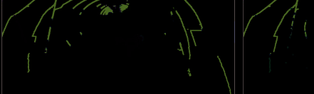

*图片来源: PDF 第 9 页, 文件名: page_09_img_1.png*

*图片来源: PDF 第 9 页, 文件名: page_09_img_2.png*

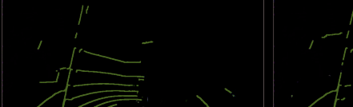

*图片来源: PDF 第 9 页, 文件名: page_09_img_3.png*

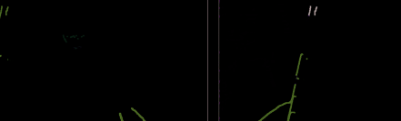

*图片来源: PDF 第 9 页, 文件名: page_09_img_4.png*

*图片来源: PDF 第 9 页, 文件名: page_09_img_5.png*

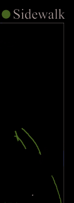

*图片来源: PDF 第 9 页, 文件名: page_09_img_6.png*

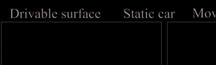

*图片来源: PDF 第 9 页, 文件名: page_09_img_7.png*

*图片来源: PDF 第 9 页, 文件名: page_09_img_8.png*

*图片来源: PDF 第 9 页, 文件名: page_09_img_9.png*

*图片来源: PDF 第 9 页, 文件名: page_09_img_10.png*

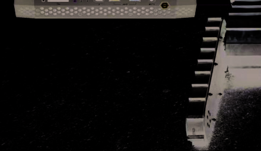

*图片来源: PDF 第 9 页, 文件名: page_09_img_11.png*

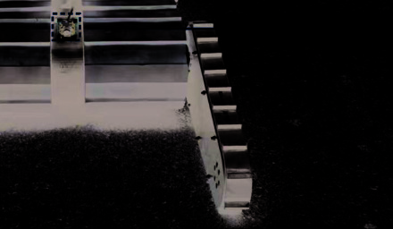

*图片来源: PDF 第 9 页, 文件名: page_09_img_12.png*

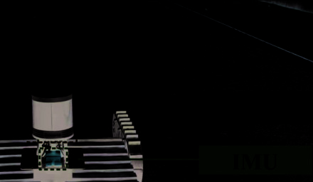

*图片来源: PDF 第 9 页, 文件名: page_09_img_13.png*

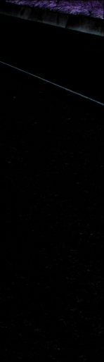

*图片来源: PDF 第 9 页, 文件名: page_09_img_14.png*

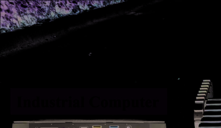

*图片来源: PDF 第 9 页, 文件名: page_09_img_15.png*

### 解析说明

[待解析：在此处填写对本节的中文解析]

---

## method significantly outperforms other 4D semantic segmen-

*页码范围: 第 9 页开始*

tation methods in terms of MOS performance, benefiting from
our framework’s explicit MOS supervision during the training
phase.
C. Operation on Real-World Platform
To substantiate the real-world utility of SegNet4D, we
further simplify and accelerate the model using half-precision
floating-point arithmetic and parallel motion feature encoding,
subsequently integrating it into an operational robotic system.
As shown in Fig. 8, our platform is equipped with a RoboSense
Helios-32 LiDAR with 10 Hz sampling frequency, an Xsens
MTI-300 IMU, a CMOS camera, and an industrial computer
with Intel Core i7-1165G7, 16G RAM, and NVIDIA RTX
2060 GPU. In the operational phase, we utilize LiDAR and
IMU data to calculate odometry poses using the FAST-LIO
[50] algorithm.

### 图片 (第 9 页)

*图片来源: PDF 第 9 页, 文件名: page_09_img_1.png*

*图片来源: PDF 第 9 页, 文件名: page_09_img_2.png*

*图片来源: PDF 第 9 页, 文件名: page_09_img_3.png*

*图片来源: PDF 第 9 页, 文件名: page_09_img_4.png*

*图片来源: PDF 第 9 页, 文件名: page_09_img_5.png*

*图片来源: PDF 第 9 页, 文件名: page_09_img_6.png*

*图片来源: PDF 第 9 页, 文件名: page_09_img_7.png*

*图片来源: PDF 第 9 页, 文件名: page_09_img_8.png*

*图片来源: PDF 第 9 页, 文件名: page_09_img_9.png*

*图片来源: PDF 第 9 页, 文件名: page_09_img_10.png*

*图片来源: PDF 第 9 页, 文件名: page_09_img_11.png*

*图片来源: PDF 第 9 页, 文件名: page_09_img_12.png*

*图片来源: PDF 第 9 页, 文件名: page_09_img_13.png*

*图片来源: PDF 第 9 页, 文件名: page_09_img_14.png*

*图片来源: PDF 第 9 页, 文件名: page_09_img_15.png*

### 解析说明

[待解析：在此处填写对本节的中文解析]

---

## Our method achieves real-time operation at 15.7Hz rate

*页码范围: 第 9 页开始*

on the self-developed platform, faster than the typical rota-
tion LiDAR sensor frame-rate of 10Hz. We also utilize this
platform to collect a dataset from the campus scene and

### 图片 (第 9 页)

*图片来源: PDF 第 9 页, 文件名: page_09_img_1.png*

*图片来源: PDF 第 9 页, 文件名: page_09_img_2.png*

*图片来源: PDF 第 9 页, 文件名: page_09_img_3.png*

*图片来源: PDF 第 9 页, 文件名: page_09_img_4.png*

*图片来源: PDF 第 9 页, 文件名: page_09_img_5.png*

*图片来源: PDF 第 9 页, 文件名: page_09_img_6.png*

*图片来源: PDF 第 9 页, 文件名: page_09_img_7.png*

*图片来源: PDF 第 9 页, 文件名: page_09_img_8.png*

*图片来源: PDF 第 9 页, 文件名: page_09_img_9.png*

*图片来源: PDF 第 9 页, 文件名: page_09_img_10.png*

*图片来源: PDF 第 9 页, 文件名: page_09_img_11.png*

*图片来源: PDF 第 9 页, 文件名: page_09_img_12.png*

*图片来源: PDF 第 9 页, 文件名: page_09_img_13.png*

*图片来源: PDF 第 9 页, 文件名: page_09_img_14.png*

*图片来源: PDF 第 9 页, 文件名: page_09_img_15.png*

### 解析说明

[待解析：在此处填写对本节的中文解析]

---

## qualitatively compare the semantic segmentation results with

*页码范围: 第 9 页开始*

Cylinder3D [1] and Mars3D [13]. All methods are only trained
on the nuScenes dataset and directly applied for inference
on our dataset. As illustrated in Fig. 9, we can see that our

### 图片 (第 9 页)

*图片来源: PDF 第 9 页, 文件名: page_09_img_1.png*

*图片来源: PDF 第 9 页, 文件名: page_09_img_2.png*

*图片来源: PDF 第 9 页, 文件名: page_09_img_3.png*

*图片来源: PDF 第 9 页, 文件名: page_09_img_4.png*

*图片来源: PDF 第 9 页, 文件名: page_09_img_5.png*

*图片来源: PDF 第 9 页, 文件名: page_09_img_6.png*

*图片来源: PDF 第 9 页, 文件名: page_09_img_7.png*

*图片来源: PDF 第 9 页, 文件名: page_09_img_8.png*

*图片来源: PDF 第 9 页, 文件名: page_09_img_9.png*

*图片来源: PDF 第 9 页, 文件名: page_09_img_10.png*

*图片来源: PDF 第 9 页, 文件名: page_09_img_11.png*

*图片来源: PDF 第 9 页, 文件名: page_09_img_12.png*

*图片来源: PDF 第 9 页, 文件名: page_09_img_13.png*

*图片来源: PDF 第 9 页, 文件名: page_09_img_14.png*

*图片来源: PDF 第 9 页, 文件名: page_09_img_15.png*

### 解析说明

[待解析：在此处填写对本节的中文解析]

---

## SegNet4D gets the best segmentation results, demonstrating its

*页码范围: 第 9 页开始*

Fig. 9.

### 图片 (第 9 页)

*图片来源: PDF 第 9 页, 文件名: page_09_img_1.png*

*图片来源: PDF 第 9 页, 文件名: page_09_img_2.png*

*图片来源: PDF 第 9 页, 文件名: page_09_img_3.png*

*图片来源: PDF 第 9 页, 文件名: page_09_img_4.png*

*图片来源: PDF 第 9 页, 文件名: page_09_img_5.png*

*图片来源: PDF 第 9 页, 文件名: page_09_img_6.png*

*图片来源: PDF 第 9 页, 文件名: page_09_img_7.png*

*图片来源: PDF 第 9 页, 文件名: page_09_img_8.png*

*图片来源: PDF 第 9 页, 文件名: page_09_img_9.png*

*图片来源: PDF 第 9 页, 文件名: page_09_img_10.png*

*图片来源: PDF 第 9 页, 文件名: page_09_img_11.png*

*图片来源: PDF 第 9 页, 文件名: page_09_img_12.png*

*图片来源: PDF 第 9 页, 文件名: page_09_img_13.png*

*图片来源: PDF 第 9 页, 文件名: page_09_img_14.png*

*图片来源: PDF 第 9 页, 文件名: page_09_img_15.png*

### 解析说明

[待解析：在此处填写对本节的中文解析]

---

## The qualitative comparison on our campus scene. Our approach

*页码范围: 第 9 页开始*

can more accurately identify the drivable surfaces, persons, and manmade
buildings, whereas Cylinder3D and MarS3D show a decline in performance.
TABLE IV
MOS GENERALIZABILITY EVALUATION ON OUR CAMPUS DATASET
TABLE V
ABLATION STUDIES ON THE NUSCENES VALIDATION SET. MOS: MOVING
OBJECT SEGMENTATION. SSS: SINGLE-SCAN SEMANTIC SEGMEN-
TATION. MANUAL MS: MANUALLY MERGING MOS AND SSS
FOR MULTI-SCAN SEMANTIC SEGMENTATION. NETWORK MS:
THE NETWORK’S PREDICTIONS FOR MULTI-SCAN SEMAN-
TIC SEGMENTATION, I.E., THE OUTPUT OF MSFM FOR
[A],[C],[D], THE OUTPUT BY ONE HEAD FOR [B]
practical utility for the real platform. Additionally, we manu-
ally annotate a sequence (900 frames) with moving labels to
quantitatively evaluate the MOS generalization performance.

### 图片 (第 9 页)

*图片来源: PDF 第 9 页, 文件名: page_09_img_1.png*

*图片来源: PDF 第 9 页, 文件名: page_09_img_2.png*

*图片来源: PDF 第 9 页, 文件名: page_09_img_3.png*

*图片来源: PDF 第 9 页, 文件名: page_09_img_4.png*

*图片来源: PDF 第 9 页, 文件名: page_09_img_5.png*

*图片来源: PDF 第 9 页, 文件名: page_09_img_6.png*

*图片来源: PDF 第 9 页, 文件名: page_09_img_7.png*

*图片来源: PDF 第 9 页, 文件名: page_09_img_8.png*

*图片来源: PDF 第 9 页, 文件名: page_09_img_9.png*

*图片来源: PDF 第 9 页, 文件名: page_09_img_10.png*

*图片来源: PDF 第 9 页, 文件名: page_09_img_11.png*

*图片来源: PDF 第 9 页, 文件名: page_09_img_12.png*

*图片来源: PDF 第 9 页, 文件名: page_09_img_13.png*

*图片来源: PDF 第 9 页, 文件名: page_09_img_14.png*

*图片来源: PDF 第 9 页, 文件名: page_09_img_15.png*

### 解析说明

[待解析：在此处填写对本节的中文解析]

---

## From the results shown in Tab. IV, our method still possesses

*页码范围: 第 9 页开始*

the best generalization ability.

### 图片 (第 9 页)

*图片来源: PDF 第 9 页, 文件名: page_09_img_1.png*

*图片来源: PDF 第 9 页, 文件名: page_09_img_2.png*

*图片来源: PDF 第 9 页, 文件名: page_09_img_3.png*

*图片来源: PDF 第 9 页, 文件名: page_09_img_4.png*

*图片来源: PDF 第 9 页, 文件名: page_09_img_5.png*

*图片来源: PDF 第 9 页, 文件名: page_09_img_6.png*

*图片来源: PDF 第 9 页, 文件名: page_09_img_7.png*

*图片来源: PDF 第 9 页, 文件名: page_09_img_8.png*

*图片来源: PDF 第 9 页, 文件名: page_09_img_9.png*

*图片来源: PDF 第 9 页, 文件名: page_09_img_10.png*

*图片来源: PDF 第 9 页, 文件名: page_09_img_11.png*

*图片来源: PDF 第 9 页, 文件名: page_09_img_12.png*

*图片来源: PDF 第 9 页, 文件名: page_09_img_13.png*

*图片来源: PDF 第 9 页, 文件名: page_09_img_14.png*

*图片来源: PDF 第 9 页, 文件名: page_09_img_15.png*

### 解析说明

[待解析：在此处填写对本节的中文解析]

---

## The above-mentioned experimental results show that Seg-

*页码范围: 第 9 页开始*

Net4D can operate in real-time on the real unmanned ground
platform while exhibiting superior performance in 4D seman-
tic segmentation and MOS. This highlights its practical utility
in enhancing robots’ environmental perception capabilities.
D. Ablation Study

### 图片 (第 9 页)

*图片来源: PDF 第 9 页, 文件名: page_09_img_1.png*

*图片来源: PDF 第 9 页, 文件名: page_09_img_2.png*

*图片来源: PDF 第 9 页, 文件名: page_09_img_3.png*

*图片来源: PDF 第 9 页, 文件名: page_09_img_4.png*

*图片来源: PDF 第 9 页, 文件名: page_09_img_5.png*

*图片来源: PDF 第 9 页, 文件名: page_09_img_6.png*

*图片来源: PDF 第 9 页, 文件名: page_09_img_7.png*

*图片来源: PDF 第 9 页, 文件名: page_09_img_8.png*

*图片来源: PDF 第 9 页, 文件名: page_09_img_9.png*

*图片来源: PDF 第 9 页, 文件名: page_09_img_10.png*

*图片来源: PDF 第 9 页, 文件名: page_09_img_11.png*

*图片来源: PDF 第 9 页, 文件名: page_09_img_12.png*

*图片来源: PDF 第 9 页, 文件名: page_09_img_13.png*

*图片来源: PDF 第 9 页, 文件名: page_09_img_14.png*

*图片来源: PDF 第 9 页, 文件名: page_09_img_15.png*

### 解析说明

[待解析：在此处填写对本节的中文解析]

---

## In this section, we conduct a series of ablation experiments

*页码范围: 第 9 页开始*

on our framework and MSFM module to test their effec-

### 图片 (第 9 页)

*图片来源: PDF 第 9 页, 文件名: page_09_img_1.png*

*图片来源: PDF 第 9 页, 文件名: page_09_img_2.png*

*图片来源: PDF 第 9 页, 文件名: page_09_img_3.png*

*图片来源: PDF 第 9 页, 文件名: page_09_img_4.png*

*图片来源: PDF 第 9 页, 文件名: page_09_img_5.png*

*图片来源: PDF 第 9 页, 文件名: page_09_img_6.png*

*图片来源: PDF 第 9 页, 文件名: page_09_img_7.png*

*图片来源: PDF 第 9 页, 文件名: page_09_img_8.png*

*图片来源: PDF 第 9 页, 文件名: page_09_img_9.png*

*图片来源: PDF 第 9 页, 文件名: page_09_img_10.png*

*图片来源: PDF 第 9 页, 文件名: page_09_img_11.png*

*图片来源: PDF 第 9 页, 文件名: page_09_img_12.png*

*图片来源: PDF 第 9 页, 文件名: page_09_img_13.png*

*图片来源: PDF 第 9 页, 文件名: page_09_img_14.png*

*图片来源: PDF 第 9 页, 文件名: page_09_img_15.png*

### 解析说明

[待解析：在此处填写对本节的中文解析]

---

## tiveness. The results are shown in Tab. V, Here, “Instance”

*页码范围: 第 9 页开始*

indicates whether instance information is integrated into the
Upsample Fusion Module to achieve instance-aware seg-
mentation. “One Head” means directly predicting multi-scan
semantic labels using only one head, indicating an end-to-end
fashion. “Two Head” means utilizing two heads (the motion
head and the semantic head, i.e., our framework) to predict
moving objects and single-scan semantic labels, respectively,
Authorized licensed use limited to: Hebei University of Technology. Downloaded on December 17,2025 at 07:34:24 UTC from IEEE Xplore.  Restrictions apply. 
15348
IEEE TRANSACTIONS ON AUTOMATION SCIENCE AND ENGINEERING, VOL. 22, 2025
TABLE VI

### 图片 (第 9 页)

*图片来源: PDF 第 9 页, 文件名: page_09_img_1.png*

*图片来源: PDF 第 9 页, 文件名: page_09_img_2.png*

*图片来源: PDF 第 9 页, 文件名: page_09_img_3.png*

*图片来源: PDF 第 9 页, 文件名: page_09_img_4.png*

*图片来源: PDF 第 9 页, 文件名: page_09_img_5.png*

*图片来源: PDF 第 9 页, 文件名: page_09_img_6.png*

*图片来源: PDF 第 9 页, 文件名: page_09_img_7.png*

*图片来源: PDF 第 9 页, 文件名: page_09_img_8.png*

*图片来源: PDF 第 9 页, 文件名: page_09_img_9.png*

*图片来源: PDF 第 9 页, 文件名: page_09_img_10.png*

*图片来源: PDF 第 9 页, 文件名: page_09_img_11.png*

*图片来源: PDF 第 9 页, 文件名: page_09_img_12.png*

*图片来源: PDF 第 9 页, 文件名: page_09_img_13.png*

*图片来源: PDF 第 9 页, 文件名: page_09_img_14.png*

*图片来源: PDF 第 9 页, 文件名: page_09_img_15.png*

### 解析说明

[待解析：在此处填写对本节的中文解析]

---

## and finally merging their results to achieve multi-scan semantic

*页码范围: 第 10 页开始*

segmentation. “Refinement” refers to moving instance refine-
ment mentioned in Sec. III-E, and it only focuses on refining
the motion predictions.
By comparing [A] and [C], we can see that incorporat-
ing instance information can improve the accuracy of MOS
and semantic segmentation, which equips the network with

### 解析说明

[待解析：在此处填写对本节的中文解析]

---

## instance-aware segmentation capabilities, and the results sub-

*页码范围: 第 10 页开始*

stantiate our second claim. In the [B] and [C], predicting
multi-scan semantic labels directly from a head is even inferior

### 解析说明

[待解析：在此处填写对本节的中文解析]

---

## to the results obtained by manually integrating outputs from

*页码范围: 第 10 页开始*

the motion head and the semantic head. This illustrates the
superiority of our framework in comparison to directly predict-
ing multi-scan semantic labels using an end-to-end manner,

### 解析说明

[待解析：在此处填写对本节的中文解析]

---

## thereby supporting our first claims. The results of [C] and

*页码范围: 第 10 页开始*

[D] indicate that the refinement is effective for improving the
motion predictions, which further proves the utility of instance
information. Besides, we manually merge the predictions of
MOS and SSS, labeled as Manual MS in the Tab. V, and

### 解析说明

[待解析：在此处填写对本节的中文解析]

---

## We can see that the MSFM’s segmentation result always

*页码范围: 第 10 页开始*

outperforms manual fusion, confirming its effectiveness in
integrating motion and static semantic predictions.
E. Runtime Analysis
To thoroughly assess the computational efficiency of our
proposed network, we conduct a comprehensive analysis of its
inference time, parameter count, and floating-point operations
(FLOPs) utilizing a single NVIDIA 3090 GPU, benchmarking
against all open-source 4D semantic segmentation networks.

### 解析说明

[待解析：在此处填写对本节的中文解析]

---

## As shown in Tab. VI, our method achieves the fastest runtime

*页码范围: 第 10 页开始*

on both the SemanticKITTI and nuScenes datasets, while
also exhibiting the lowest FLOPs, demonstrating its superior
computational efficiency. Furthermore, our network comprises
35.7M parameters, indicating small memory consumption suit-
able for limited onboard resources.

### 解析说明

[待解析：在此处填写对本节的中文解析]

---

## V. CONCLUSION AND FUTURE WORK

*页码范围: 第 10 页开始*

In this paper, we present a novel 4D semantic segmentation

### 解析说明

[待解析：在此处填写对本节的中文解析]

---

## method to predict both point-wise moving labels and semantic

*页码范围: 第 10 页开始*

labels for LiDAR data, and operate in real-time. The frame-
work decomposes the complex 4D semantic segmentation task
into MOS and SSS tasks, finally merging their predictions to
achieve more accurate 4D semantic segmentation. We adopt a

### 解析说明

[待解析：在此处填写对本节的中文解析]

---

## projection-based approach to quickly obtain motion features,

*页码范围: 第 10 页开始*

which significantly reduces the computational complexity
compared to 4D convolutions. To achieve instance-aware seg-
mentation, we concatenate the motion features with the spatial
features of the current scan, feeding them into the network
for instance detection, and subsequently inject the instance
features into the prediction pipeline. In addition, we design
a motion-semantic fusion module to integrate the point-wise
motion states and static semantic predictions, enabling motion-

### 解析说明

[待解析：在此处填写对本节的中文解析]

---

## guided 4D semantic segmentation. Extensive experiments on

*页码范围: 第 10 页开始*

multiple datasets and a real-world unmanned ground platform

### 解析说明

[待解析：在此处填写对本节的中文解析]

---

## demonstrate the superiority of our method. The detailed run-

*页码范围: 第 10 页开始*

time analysis further highlights its computational efficiency,
confirming its real-time operation feasibility across diverse
LiDAR configurations.
Despite its strengths, our system faces limitations, notably,
BEV-based motion extraction fashion may overlook moving
objects obscured in the Z-direction. Future studies may inte-
grate the range images to enhance the robustness of motion
feature extraction. Additionally, SegNet4D currently cannot
operate on embedded GPU platforms due to limitations in
3D sparse convolution version. Subsequently, we may employ
TensorRT to accelerate the model, further enhancing its effi-
ciency and integrating it into low-cost robot platforms. Beyond
the aforementioned, future studies may exploit the instance
information we introduced to broaden the network’s capabili-
ties, including panoptic segmentation [37] and 4D panoptic
segmentation [36]. Furthermore, studies could leverage our
predicted 4D semantic labels to boost robotic autonomy,
particularly in applications such as semantic SLAM [6],
semantic-based navigation [3] or planning [51].

### 解析说明

[待解析：在此处填写对本节的中文解析]

---

## REFERENCES

*页码范围: 第 10 页开始*

[1]
X. Zhu et al., “Cylindrical and asymmetrical 3D convolution networks
for LiDAR-based perception,” IEEE Trans. Pattern Anal. Mach. Intell.,
vol. 44, no. 10, pp. 6807–6822, Oct. 2022.
[2]
J. Kim, J. Woo, and S. Im, “RVMOS: Range-view moving object
segmentation leveraged by semantic and motion features,” IEEE Robot.
Autom. Lett., vol. 7, no. 3, pp. 8044–8051, Jul. 2022.
[3]
S. Felicioni, E. Burani, M. Leomanni, M. L. Fravolini, P. Valigi, and
G. Costante, “Integrating occupancy grid with semantic road information
for autonomous navigation in urban scenarios: A benchmark study,”
in Proc. IEEE 20th Int. Conf. Autom. Sci. Eng. (CASE), Aug. 2024,
pp. 2665–2671.
[4]
C.
Shi,
X.
Chen,
H.
Lu,
W.
Deng,
J.
Xiao,
and
B.
Dai,
“RDMNet: Reliable dense matching based point cloud registration for
autonomous driving,” IEEE Trans. Intell. Transp. Syst., vol. 24, no. 10,
pp. 11372–11383, Oct. 2023.
[5]
Z. Qiao, Z. Yu, B. Jiang, H. Yin, and S. Shen, “G3Reg: Pyramid graph-
based global registration using Gaussian ellipsoid model,” IEEE Trans.
Autom. Sci. Eng., vol. 22, pp. 3416–3432, 2025.
[6]
J. Jiao et al., “Real-time metric-semantic mapping for autonomous
navigation in outdoor environments,” IEEE Trans. Autom. Sci. Eng.,
vol. 22, pp. 5729–5740, 2025.
[7]
X. Chen, A. Milioto, E. Palazzolo, P. Gigu`ere, J. Behley, and
C. Stachniss, “SuMa++: Efficient LiDAR-based semantic SLAM,”
in Proc. IEEE/RSJ Intl. Conf. Intell. Robots Syst. (IROS), Nov.
2019, pp. 4530–4537. [Online]. Available: http://www.ipb.uni-bonn.de/
wp-content/papercite-data/pdf/chen2019iros.pdf
[8]
F. Wang, Z. Wu, Y. Yang, W. Li, Y. Liu, and Y. Zhuang, “Real-time
semantic segmentation of LiDAR point clouds on edge devices for
unmanned systems,” IEEE Trans. Instrum. Meas., vol. 72, pp. 1–11,
2023.
[9]
H. Thomas, C. R. Qi, J.-E. Deschaud, B. Marcotegui, F. Goulette, and
L. Guibas, “KPConv: Flexible and deformable convolution for point
clouds,” in Proc. IEEE/CVF Int. Conf. Comput. Vis. (ICCV), Oct. 2019,
pp. 6410–6419.
Authorized licensed use limited to: Hebei University of Technology. Downloaded on December 17,2025 at 07:34:24 UTC from IEEE Xplore.  Restrictions apply. 
WANG et al.: SegNet4D: EFFICIENT INSTANCE-AWARE 4D SEMANTIC SEGMENTATION
15349
[10] S. Li, X. Chen, Y. Liu, D. Dai, C. Stachniss, and J. Gall, “Multi-scale
interaction for real-time LiDAR data segmentation on an embed-
ded platform,” IEEE Robot. Autom. Lett., vol. 7, no. 2, pp. 738–745,
Apr. 2022. [Online]. Available: https://www.ipb.uni-bonn.de/wp-content/
papercite-data/pdf/li2022ral.pdf
[11] H.
Shi,
G.
Lin,
H.
Wang,
T.-Y.
Hung,
and
Z.
Wang,
“SpSequenceNet:
Semantic
segmentation
network
on
4D
point
clouds,”
in
Proc.
IEEE/CVF
Conf.
Comput.
Vis.
Pattern
Recognit. (CVPR), Jun. 2020, pp. 4573–4582. [Online]. Available:
https://openaccess.thecvf.com/content CVPR 2020/papers/
Shi SpSequenceNet Semantic Segmentation Network on 4D Point
Clouds CVPR 2020 paper.pdf
[12] F. Duerr, M. Pfaller, H. Weigel, and J. Beyerer, “LiDAR-based recurrent
3D semantic segmentation with temporal memory alignment,” in Proc.
Int. Conf. 3D Vis. (3DV), Nov. 2020, pp. 781–790. [Online]. Available:
https://api.semanticscholar.org/CorpusID:231684481
[13] J. Liu, C. Chang, J. Liu, X. Wu, L. Ma, and X. Qi, “MarS3D:
A plug-and-play motion-aware model for semantic segmentation on
multi-scan 3D point clouds,” in Proc. IEEE/CVF Conf. Comput. Vis.
Pattern Recognit. (CVPR), Jun. 2023, pp. 9372–9381. [Online]. Avail-
able: https://api.semanticscholar.org/CorpusID:259950838
[14] J. Behley et al., “SemanticKITTI: A dataset for semantic scene under-
standing of LiDAR sequences,” in Proc. IEEE/CVF Int. Conf. Comput.
Vis. (ICCV), Oct. 2019, pp. 9297–9307.
[15] C. Choy, J. Gwak, and S. Savarese, “4D spatio-temporal ConvNets:
Minkowski convolutional neural networks,” in Proc. IEEE/CVF Conf.
Comput. Vis. Pattern Recognit. (CVPR), Jun. 2019, pp. 3070–3079.

### 解析说明

[待解析：在此处填写对本节的中文解析]

---

## [16] P. Schutt, R. A. Rosu, and S. Behnke, “Abstract flow for temporal

*页码范围: 第 11 页开始*

semantic segmentation on the permutohedral lattice,” in Proc. Int. Conf.
Robot. Autom. (ICRA), May 2022, pp. 5139–5145.
[17] N. Wang, C. Shi, R. Guo, H. Lu, Z. Zheng, and X. Chen, “InsMOS:
Instance-aware moving object segmentation in LiDAR data,” in
Proc. IEEE/RSJ Int. Conf. Intell. Robots Syst. (IROS), Oct. 2023,
pp. 7598–7605.
[18] X. Chen et al., “Automatic labeling to generate training data for online
LiDAR-based moving object segmentation,” IEEE Robot. Autom. Lett.,
vol. 7, no. 3, pp. 6107–6114, Jul. 2022.
[19] P.
W.
Patil,
K.
M.
Biradar,
A.
Dudhane,
and
S.
Murala,
“An
end-to-end
edge
aggregation
network
for
moving
object
segmentation,” in Proc. IEEE/CVF Conf. Comput. Vis. Pattern Recognit.
(CVPR),
Jun.
2020,
pp. 8146–8155.
[Online].
Available:
https://
openaccess.thecvf.com/content CVPR 2020/papers/Patil An End-
to-End Edge Aggregation Network for Moving Object
Segmentation CVPR 2020 paper.pdf
[20] J. H. Giraldo, S. Javed, and T. Bouwmans, “Graph moving object
segmentation,” IEEE Trans. Pattern Anal. Mach. Intell., vol. 44, no. 5,
pp. 2485–2503, May 2022.
[21] X. Chen et al., “Moving object segmentation in 3D LiDAR data:

### 解析说明

[待解析：在此处填写对本节的中文解析]

---

## A learning-based approach exploiting sequential data,” IEEE Robot.

*页码范围: 第 11 页开始*

Autom. Lett., vol. 6, no. 4, pp. 6529–6536, Oct. 2021. [Online]. Avail-
able: http://www.ipb.uni-bonn.de/pdfs/chen2021ral-iros.pdf
[22] J. Sun et al., “Efficient spatial–temporal information fusion for LiDAR-
based 3D moving object segmentation,” in Proc. IEEE/RSJ Int. Conf.
Intell. Robots Syst. (IROS), Oct. 2022, pp. 11456–11463.
[23] J. Cheng et al., “MF-MOS: A motion-focused model for mov-
ing object segmentation,” in Proc. IEEE Int. Conf. Robot. Autom.
(ICRA), May 2024, pp. 12499–12505. [Online]. Available: https://
api.semanticscholar.org/CorpusID:267320275
[24] S. Mohapatra et al., “LiMoSeg: Real-time bird’s eye view based LiDAR
motion segmentation,” 2021, arXiv:2111.04875.
[25] B. Zhou, J. Xie, Y. Pan, J. Wu, and C. Lu, “MotionBEV: Attention-aware
online LiDAR moving object segmentation with bird’s eye view based
appearance and motion features,” IEEE Robot. Autom. Lett., vol. 8,
no. 12, pp. 8074–8081, Dec. 2023.
[26] B. Mersch, X. Chen, I. Vizzo, L. Nunes, J. Behley, and C. Stach-
niss, “Receding moving object segmentation in 3D LiDAR data using
sparse 4D convolutions,” IEEE Robot. Autom. Lett., vol. 7, no. 3,
pp. 7503–7510, Jul. 2022.
[27] T. Kreutz, M. M¨uhlh¨auser, and A. S. Guinea, “Unsupervised 4D LiDAR
moving object segmentation in stationary settings with multivariate
occupancy time series,” in Proc. IEEE/CVF Winter Conf. Appl. Comput.
Vis. (WACV), Jan. 2023, pp. 1644–1653.
[28] E. Li, S. Casas, and R. Urtasun, “MemorySeg: Online LiDAR semantic
segmentation with a latent memory,” in Proc. IEEE/CVF Int. Conf.
Comput. Vis. (ICCV), Oct. 2023, pp. 745–754. [Online]. Available:
https://api.semanticscholar.org/CorpusID:265019334
[29] H. Shi, J. Wei, H. Wang, F. Liu, and G. Lin, “Learning temporal
variations for 4D point cloud segmentation,” Int. J. Comput. Vis.,
vol. 132, no. 12, pp. 5603–5617, Dec. 2024. [Online]. Available: https://
api.semanticscholar.org/CorpusID:270670906
[30] X. Chen, S. Xu, X. Zou, T. Cao, D.-Y. Yeung, and L. Fang,
“SVQNet: Sparse voxel-adjacent query network for 4D spatio-temporal
LiDAR semantic segmentation,” in Proc. IEEE/CVF Int. Conf. Comput.
Vis. (ICCV), Oct. 2023, pp. 8535–8544. [Online]. Available: https://
api.semanticscholar.org/CorpusID:261214641
[31] K. Yilmaz, J. Schult, A. Nekrasov, and B. Leibe, “Mask4Former: Mask
transformer for 4D panoptic segmentation,” in Proc. IEEE Int. Conf.
Robot. Autom. (ICRA), May 2024, pp. 9418–9425.
[32] F. Hong, L. Kong, H. Zhou, X. Zhu, H. Li, and Z. Liu, “Unified 3D and
4D panoptic segmentation via dynamic shifting networks,” IEEE Trans.
Pattern Anal. Mach. Intell., vol. 46, no. 5, pp. 3480–3495, May 2024.
[33] I. Fradlin, I. Zulfikar, K. Yilmaz, T. Kontogianni, and B. Leibe,
“Interactive4D: Interactive 4D LiDAR segmentation,” in Proc. IEEE Int.
Conf. Robot. Autom. (ICRA), Oct. 2025, pp. 1–15.
[34] B.
Graham,
M.
Engelcke,
and
L.
V.
D.
Maaten,
“3D
semantic
segmentation
with
submanifold
sparse
convolutional
networks,”
in
Proc.
IEEE/CVF
Conf.
Comput.
Vis.
Pattern
Recognit.,
Jun.
2018,
pp. 9224–9232.
[Online].
Available:
http://openaccess.thecvf.com/content cvpr 2018/papers/
Graham 3D Semantic Segmentation CVPR 2018 paper.pdf
[35] X. Lai, Y. Chen, F. Lu, J. Liu, and J. Jia, “Spherical transformer for
LiDAR-based 3D recognition,” in Proc. IEEE/CVF Conf. Comput. Vis.
Pattern Recognit. (CVPR), Jun. 2023, pp. 17545–17555.
[36] M. Ayg¨un et al., “4D panoptic LiDAR segmentation,” in Proc.
IEEE/CVF Conf. Comput. Vis. Pattern Recognit. (CVPR), Jun. 2021,
pp. 5523–5533.
[37] R. Marcuzzi, L. Nunes, L. Wiesmann, J. Behley, and C. Stachniss,
“Mask-based panoptic LiDAR segmentation for autonomous driving,”
IEEE Robot. Autom. Lett., vol. 8, no. 2, pp. 1141–1148, Feb. 2023.
[38] R. B. Rusu and S. Cousins, “3D is here: Point cloud library (PCL),” in
Proc. IEEE Int. Conf. Robot. Autom., May 2011, pp. 1–4.
[39] H. Hotelling, “Analysis of a complex of statistical variables into
principal components,” J. Educ. Psychol., vol. 24, no. 7, pp. 498–520,
Oct.
1933.
[Online].
Available:
https://api.semanticscholar.org/
CorpusID:144828484
[40] X. Zhang, W. Xu, C. Dong, and J. M. Dolan, “Efficient L-shape fitting
for vehicle detection using laser scanners,” in Proc. IEEE Intell. Vehicles
Symp., Jun. 2017, pp. 54–59.
[41] T. Yin, X. Zhou, and P. Kr¨ahenb¨uhl, “Center-based 3D object detection
and tracking,” in Proc. IEEE/CVF Conf. Comput. Vis. Pattern Recognit.
(CVPR), Jun. 2021, pp. 11779–11788.
[42] H. Li, G. Chen, G. Li, and Y. Yu, “Motion guided attention for video
salient object detection,” in Proc. IEEE/CVF Int. Conf. Comput. Vis.
(ICCV), Oct. 2019, pp. 7273–7282.
[43] S. Woo, J. Park, J.-Y. Lee, and I. S. Kweon, “CBAM: Convolutional
block attention module,” in Proc. Eur. Conf. Comput. Vis., Sep. 2018,
pp. 3–19.
[44] L. Liebel and M. K¨orner, “Auxiliary tasks in multi-task learning,” 2018,
arXiv:1805.06334.
[45] H. Caesar et al., “NuScenes: A multimodal dataset for autonomous
driving,” in Proc. IEEE/CVF Conf. Comput. Vis. Pattern Recognit.
(CVPR), Jun. 2020, pp. 11618–11628. [Online]. Available: https://
api.semanticscholar.org/CorpusID:85517967
[46] A. Geiger, P. Lenz, and R. Urtasun, “Are we ready for autonomous
driving? The KITTI vision benchmark suite,” in Proc. IEEE Conf.
Comput. Vis. Pattern Recognit., Jun. 2012, pp. 3354–3361. [Online].
Available: http://www.cvlibs.net/publications/Geiger2012CVPR.pdf
[47] A. Paszke et al., “Pytorch: An imperative style, high-performance
deep learning library,” in Proc. Adv. Neural Inf. Process. Syst., 2019,
pp. 8026–8037. [Online]. Available: http://papers.nips.cc/paper/9015-
pytorch-an-imperative-style-high-performance-deep-learning-library.pdf

### 解析说明

[待解析：在此处填写对本节的中文解析]

---

## [48] D. Kingma and J. Ba, “Adam: A method for stochastic optimization,”

*页码范围: 第 11 页开始*

2014, arXiv:1412.6980.
[49] M.
Everingham,
L.
Van
Gool,
C.
K.
I.
Williams,
J.
Winn,
and
A.
Zisserman,
“The
Pascal
visual
object
classes
(VOC)
challenge,”
Int.
J.
Comput.
Vis.,
vol. 88,
no. 2,
pp. 303–338,
2010.
[Online].
Available:
https://pdfs.semanticscholar.org/0ee1/
916a0cb2dc7d3add086b5f1092c3d4beb38a.pdf
[50] W. Xu, Y. Cai, D. He, J. Lin, and F. Zhang, “FAST-LIO2: Fast
direct LiDAR-inertial odometry,” IEEE Trans. Robot., vol. 38, no. 4,
pp. 2053–2073, Aug. 2022.
Authorized licensed use limited to: Hebei University of Technology. Downloaded on December 17,2025 at 07:34:24 UTC from IEEE Xplore.  Restrictions apply. 
15350
IEEE TRANSACTIONS ON AUTOMATION SCIENCE AND ENGINEERING, VOL. 22, 2025
[51] L. Lu et al., “Semantics-aware receding horizon planner for object-
centric active mapping,” IEEE Robot. Autom. Lett., vol. 9, no. 4,
pp. 3838–3845, Apr. 2024.
Neng Wang received the B.E. degree in automa-
tion from Southwest Petroleum University, China,
in 2021. He is currently pursuing the Ph.D. degree
with the National University of Defense Technol-
ogy (NUDT). His research interests include point
cloud segmentation and semantic-based simultane-
ous localization and mapping (SLAM).
Ruibin Guo received the B.S. degree in communica-
tion engineering, the M.S. degree in information and
communication engineering, and the Ph.D. degree
from the National University of Defense Technology
(NUDT), in 2012, 2014, and 2019, respectively. He
is currently a Lecturer with NUDT. His research
interests include computer vision, simultaneous
localization and mapping, and 3D reconstruction.
Chenghao
Shi
received the B.E. degree from
Nanjing University of Aeronautics and Astronautics
(NUAA) and the M.E. and Ph.D. degrees in robotics
from the National University of Defense Technology
(NUDT), China, in 2017, 2019, and 2024, respec-
tively. He is currently a Lecturer with the NUDT,
China. His research interests include localization and
mobile robots.
Ziyue Wang received the Bachelor of Engineering
degree from Nanjing University of Science and
Technology (NJUST) in 2023. He is currently pursu-
ing the Ph.D. degree with the National University of
Defense Technology (NUDT). His research interests
include uncertainty of mapping.
Hui Zhang received the B.E., M.E., and Ph.D.
degrees from the National University of Defense
Technology, China, in 1993, 1996, and 2000, respec-
tively. He became a Professor with the National
University of Defense Technology in 2011. His
research interests include mobile robots, simul-
taneous localization and mapping, and intelligent
control.
Huimin Lu (Member, IEEE) received the B.E.
degree in automation and the M.E. and Ph.D. degrees
in control science and engineering from the National
University of Defense Technology (NUDT), Chang-
sha, China, in 2003, 2005, and 2010, respectively.
He joined the College of Intelligence Science and
Technology, NUDT, in 2010, where he is cur-
rently a Professor. His research interests include
mobile robotics, mainly robot vision, multi-robot
coordination, and human-robot interaction.
Zhiqiang Zheng received the Ph.D. degree in
aerospace engineering from the University of Liege,
Liege, Belgium, in 1994. He is currently a Professor
with the College of Intelligent Science and Tech-
nology, National University of Defense Technology,
Changsha, China. His research interests include
precision guidance and control and multirobot
coordination control.
Xieyuanli
Chen
(Member, IEEE) received the
bachelor’s degree in electrical engineering and
automation from Hunan University, China, in 2015,
the master’s degree in robotics from the National
University of Defense Technology, China, in 2017,
and the Ph.D. degree from the Photogrammetry
and Robotics Laboratory, University of Bonn. He is
currently an Associate Professor with the National
University of Defense Technology, China. He also
serves as an Associate Editor for IEEE ROBOTICS
AND AUTOMATION LETTERS.
Authorized licensed use limited to: Hebei University of Technology. Downloaded on December 17,2025 at 07:34:24 UTC from IEEE Xplore.  Restrictions apply. 

### 解析说明

[待解析：在此处填写对本节的中文解析]

---

## 附加图片

*以下是其他页面提取的图片*

### 第 12 页图片

